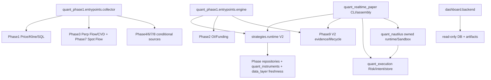

# 模块依赖图

审计日期：2026-10-07（Asia/Shanghai）。源码基线：`4c2bc9cf7d80ddda20a316d43f18893d7a9d8031`，来源 `origin/fix/phase9-decision-advisory-lock`；GitHub main 仅交接文档，不能作为源码基线。清理分支：`cleanup/ai-tech-debt-v1`。

ACTIVE 表示存在源码运行路径，条件模块不代表当前已启用。LEGACY_ACTIVE 表示仍被兼容路径引用；TEST_ONLY/FIXTURE_ONLY 只服务正式测试/合成验收；DEAD 必须无调用者；UNKNOWN 不能删除。

## 精确 import 证据（审计基线）

### dashboard → quant_execution

- `src/dashboard/backend/service.py:21 -> quant_execution.risk_config`

### dashboard → quant_realtime_paper

- `src/dashboard/backend/service.py:10 -> quant_realtime_paper.store`

### quant_execution → quant_data_layer

- `src/quant_execution/risk.py:7 -> quant_data_layer.freshness`

### quant_execution → quant_phase9

- `src/quant_execution/contracts.py:11 -> quant_phase9.canonical`
- `src/quant_execution/contracts.py:12 -> quant_phase9.contracts`
- `src/quant_execution/funding.py:7 -> quant_phase9.canonical`
- `src/quant_execution/paper_v1.py:5 -> quant_phase9.paper_v1`
- `src/quant_execution/paper_v1.py:6 -> quant_phase9.canonical`
- `src/quant_execution/paper_v1.py:55 -> quant_phase9.paper_v1`
- `src/quant_execution/paper_v1.py:56 -> quant_phase9.canonical`
- `src/quant_execution/persistence.py:9 -> quant_phase9.canonical`
- `src/quant_execution/risk.py:6 -> quant_phase9.canonical`
- `src/quant_execution/risk.py:92 -> quant_phase9.paper_v1`
- `src/quant_execution/trade_plan.py:9 -> quant_phase9.canonical`

### quant_execution → strategies

- `src/quant_execution/risk_config.py:12 -> strategies.contracts`
- `src/quant_execution/trade_plan.py:5 -> strategies.contracts`

### quant_features → quant_phase9

- `src/quant_features/core.py:7 -> quant_phase9.canonical`

### quant_nautilus → quant_execution

- `src/quant_nautilus/acceptance.py:31 -> quant_execution.contracts`
- `src/quant_nautilus/acceptance.py:32 -> quant_execution.funding`
- `src/quant_nautilus/acceptance.py:33 -> quant_execution.risk`
- `src/quant_nautilus/adapter.py:20 -> quant_execution.contracts`
- `src/quant_nautilus/adapter.py:345 -> quant_execution.costs`
- `src/quant_nautilus/fixture_setup.py:13 -> quant_execution.persistence`
- `src/quant_nautilus/funding.py:9 -> quant_execution.funding`
- `src/quant_nautilus/instruments.py:17 -> quant_execution.paper_v1`
- `src/quant_nautilus/owned_runtime.py:6 -> quant_execution.persistence`
- `src/quant_nautilus/paper.py:27 -> quant_execution.contracts`
- `src/quant_nautilus/paper.py:28 -> quant_execution.funding`
- `src/quant_nautilus/paper.py:29 -> quant_execution.persistence`
- `src/quant_nautilus/paper.py:108 -> quant_execution.contracts`
- `src/quant_nautilus/paper_acceptance.py:17 -> quant_execution.persistence`
- `src/quant_nautilus/realtime_paper_adapter.py:9 -> quant_execution.contracts`
- `src/quant_nautilus/realtime_paper_adapter.py:15 -> quant_execution.persistence`

### quant_nautilus → quant_phase1

- `src/quant_nautilus/acceptance.py:14 -> quant_phase1.contracts`
- `src/quant_nautilus/acceptance.py:15 -> quant_phase1.stage1`
- `src/quant_nautilus/fixture_setup.py:15 -> quant_phase1.db`
- `src/quant_nautilus/paper_acceptance.py:19 -> quant_phase1.db`
- `src/quant_nautilus/realtime_paper_adapter.py:17 -> quant_phase1.contracts`

### quant_nautilus → quant_phase9

- `src/quant_nautilus/acceptance.py:16 -> quant_phase9.canonical`
- `src/quant_nautilus/acceptance.py:17 -> quant_phase9.contracts`
- `src/quant_nautilus/acceptance.py:21 -> quant_phase9.decision`
- `src/quant_nautilus/acceptance.py:22 -> quant_phase9.evidence`
- `src/quant_nautilus/acceptance.py:23 -> quant_phase9.intake`
- `src/quant_nautilus/acceptance.py:24 -> quant_phase9.patterns`
- `src/quant_nautilus/acceptance.py:25 -> quant_phase9.policy`
- `src/quant_nautilus/acceptance.py:29 -> quant_phase9.sources`
- `src/quant_nautilus/acceptance.py:30 -> quant_phase9.validator`
- `src/quant_nautilus/acceptance.py:203 -> quant_phase9.persistence`
- `src/quant_nautilus/adapter.py:21 -> quant_phase9.canonical`
- `src/quant_nautilus/fixture_setup.py:16 -> quant_phase9.canonical`
- `src/quant_nautilus/owned_runtime.py:8 -> quant_phase9.canonical`
- `src/quant_nautilus/paper.py:32 -> quant_phase9.canonical`
- `src/quant_nautilus/paper_acceptance.py:20 -> quant_phase9.canonical`
- `src/quant_nautilus/realtime_paper_adapter.py:18 -> quant_phase9.canonical`

### quant_nautilus → strategies

- `src/quant_nautilus/instruments.py:6 -> strategies.market_view`

### quant_phase1 → quant_data_layer

- `src/quant_phase1/entrypoints/collector.py:42 -> quant_data_layer.errors`
- `src/quant_phase1/entrypoints/collector.py:43 -> quant_data_layer.admission`
- `src/quant_phase1/entrypoints/collector.py:49 -> quant_data_layer.db_admission`
- `src/quant_phase1/entrypoints/collector.py:50 -> quant_data_layer.observability`
- `src/quant_phase1/entrypoints/engine.py:35 -> quant_data_layer.errors`
- `src/quant_phase1/entrypoints/engine.py:36 -> quant_data_layer.admission`
- `src/quant_phase1/entrypoints/engine.py:42 -> quant_data_layer.observability`
- `src/quant_phase1/entrypoints/engine.py:718 -> quant_data_layer.db_admission`
- `src/quant_phase1/pipeline.py:13 -> quant_data_layer.freshness`
- `src/quant_phase1/runtime.py:13 -> quant_data_layer.errors`
- `src/quant_phase1/service.py:10 -> quant_data_layer.errors`
- `src/quant_phase1/stage1.py:12 -> quant_data_layer.freshness`

### quant_phase1 → quant_phase2

- `src/quant_phase1/entrypoints/engine.py:52 -> quant_phase2.runtime`
- `src/quant_phase1/entrypoints/engine.py:53 -> quant_phase2.persistence`

### quant_phase1 → quant_phase3

- `src/quant_phase1/entrypoints/collector.py:66 -> quant_phase3.adapters.bitget`
- `src/quant_phase1/entrypoints/collector.py:67 -> quant_phase3.adapters.bybit`
- `src/quant_phase1/entrypoints/collector.py:68 -> quant_phase3.adapters.hyperliquid`
- `src/quant_phase1/entrypoints/collector.py:69 -> quant_phase3.cvd`
- `src/quant_phase1/entrypoints/collector.py:70 -> quant_phase3.cross_exchange`
- `src/quant_phase1/entrypoints/collector.py:71 -> quant_phase3.rollup`
- `src/quant_phase1/entrypoints/collector.py:72 -> quant_phase3.runtime`
- `src/quant_phase1/entrypoints/collector.py:73 -> quant_phase3.subscriptions`
- `src/quant_phase1/entrypoints/collector.py:214 -> quant_phase3.persistence`
- `src/quant_phase1/entrypoints/collector.py:700 -> quant_phase3.persistence`
- `src/quant_phase1/entrypoints/engine.py:54 -> quant_phase3.enrichment`
- `src/quant_phase1/entrypoints/engine.py:55 -> quant_phase3.persistence`

### quant_phase1 → quant_phase4

- `src/quant_phase1/entrypoints/collector.py:132 -> quant_phase4.persistence`
- `src/quant_phase1/entrypoints/collector.py:308 -> quant_phase4.runtime`
- `src/quant_phase1/entrypoints/engine.py:387 -> quant_phase4.contracts`
- `src/quant_phase1/entrypoints/engine.py:388 -> quant_phase4.cross_exchange`
- `src/quant_phase1/entrypoints/engine.py:389 -> quant_phase4.enrichment`
- `src/quant_phase1/entrypoints/engine.py:390 -> quant_phase4.persistence`

### quant_phase1 → quant_phase5

- `src/quant_phase1/entrypoints/engine.py:176 -> quant_phase5.runtime`
- `src/quant_phase1/entrypoints/engine.py:744 -> quant_phase5.runtime`

### quant_phase1 → quant_phase6

- `src/quant_phase1/entrypoints/collector.py:317 -> quant_phase6.runtime`
- `src/quant_phase1/entrypoints/engine.py:341 -> quant_phase6.contracts`
- `src/quant_phase1/entrypoints/engine.py:342 -> quant_phase6.enrichment`
- `src/quant_phase1/entrypoints/engine.py:862 -> quant_phase6.runtime`

### quant_phase1 → quant_phase7

- `src/quant_phase1/config.py:374 -> quant_phase7.source_config`
- `src/quant_phase1/entrypoints/collector.py:288 -> quant_phase7.runtime`
- `src/quant_phase1/entrypoints/collector.py:890 -> quant_phase7.flow_scope`
- `src/quant_phase1/entrypoints/engine.py:418 -> quant_phase7.runtime`
- `src/quant_phase1/entrypoints/engine.py:872 -> quant_phase7.runtime`

### quant_phase1 → quant_phase8

- `src/quant_phase1/entrypoints/collector.py:78 -> quant_phase8.config`
- `src/quant_phase1/entrypoints/collector.py:79 -> quant_phase8.runtime`

### quant_phase1 → quant_phase9

- `src/quant_phase1/entrypoints/engine.py:56 -> quant_phase9.config`
- `src/quant_phase1/entrypoints/engine.py:719 -> quant_phase9.policy`
- `src/quant_phase1/entrypoints/engine.py:720 -> quant_phase9.runtime`
- `src/quant_phase1/service.py:89 -> quant_phase9.intake`

### quant_phase1 → strategies

- `src/quant_phase1/entrypoints/engine.py:23 -> strategies.runtime`
- `src/quant_phase1/entrypoints/engine.py:721 -> strategies.runtime`
- `src/quant_phase1/pipeline.py:119 -> strategies.market_view`
- `src/quant_phase1/pipeline.py:120 -> strategies.screener.batch_screener`

### quant_phase2 → quant_data_layer

- `src/quant_phase2/runtime.py:27 -> quant_data_layer.freshness`

### quant_phase2 → quant_phase1

- `src/quant_phase2/contracts.py:15 -> quant_phase1.time`
- `src/quant_phase2/enrichment.py:7 -> quant_phase1.stage1`
- `src/quant_phase2/runtime.py:17 -> quant_phase1.db`
- `src/quant_phase2/runtime.py:18 -> quant_phase1.time`
- `src/quant_phase2/runtime.py:30 -> quant_phase1.repositories`

### quant_phase2 → strategies

- `src/quant_phase2/adapters/aggregator.py:4 -> strategies.contracts`
- `src/quant_phase2/adapters/aggregator.py:93 -> strategies.native_periods`

### quant_phase3 → quant_data_layer

- `src/quant_phase3/queue.py:11 -> quant_data_layer.admission`
- `src/quant_phase3/queue.py:12 -> quant_data_layer.backpressure`

### quant_phase3 → quant_phase1

- `src/quant_phase3/enrichment.py:10 -> quant_phase1.stage1`
- `src/quant_phase3/runtime.py:19 -> quant_phase1.config`

### quant_phase4 → quant_data_layer

- `src/quant_phase4/liquidation.py:10 -> quant_data_layer.admission`
- `src/quant_phase4/liquidation.py:11 -> quant_data_layer.backpressure`
- `src/quant_phase4/liquidation.py:12 -> quant_data_layer.observability`
- `src/quant_phase4/runtime.py:17 -> quant_data_layer.admission`
- `src/quant_phase4/runtime.py:23 -> quant_data_layer.observability`

### quant_phase4 → quant_phase1

- `src/quant_phase4/adapters/base.py:15 -> quant_phase1.adapters.bitget_v3.rate_limit`
- `src/quant_phase4/enrichment.py:10 -> quant_phase1.stage1`
- `src/quant_phase4/runtime.py:15 -> quant_phase1.config`
- `src/quant_phase4/runtime.py:16 -> quant_phase1.adapters.bitget_v3.rate_limit`
- `src/quant_phase4/runtime.py:460 -> quant_phase1.contracts`

### quant_phase5 → quant_phase1

- `src/quant_phase5/breadth.py:9 -> quant_phase1.config`
- `src/quant_phase5/breadth.py:10 -> quant_phase1.time`
- `src/quant_phase5/contracts.py:17 -> quant_phase1.time`
- `src/quant_phase5/enrichment.py:9 -> quant_phase1.config`
- `src/quant_phase5/enrichment.py:10 -> quant_phase1.stage1`
- `src/quant_phase5/enrichment.py:11 -> quant_phase1.time`
- `src/quant_phase5/health.py:10 -> quant_phase1.time`
- `src/quant_phase5/market_context.py:10 -> quant_phase1.config`
- `src/quant_phase5/market_context.py:11 -> quant_phase1.contracts`
- `src/quant_phase5/market_context.py:12 -> quant_phase1.freshness`
- `src/quant_phase5/market_context.py:13 -> quant_phase1.market.closed_bars`
- `src/quant_phase5/market_context.py:14 -> quant_phase1.market.structure`
- `src/quant_phase5/market_context.py:15 -> quant_phase1.time`
- `src/quant_phase5/regime.py:8 -> quant_phase1.config`
- `src/quant_phase5/regime.py:9 -> quant_phase1.time`
- `src/quant_phase5/relative_strength.py:9 -> quant_phase1.config`
- `src/quant_phase5/relative_strength.py:10 -> quant_phase1.time`
- `src/quant_phase5/retention.py:8 -> quant_phase1.config`
- `src/quant_phase5/retention.py:9 -> quant_phase1.time`
- `src/quant_phase5/runtime.py:12 -> quant_phase1.pipeline`
- `src/quant_phase5/runtime.py:13 -> quant_phase1.stage1`
- `src/quant_phase5/runtime.py:14 -> quant_phase1.time`
- `src/quant_phase5/sector_context.py:9 -> quant_phase1.config`
- `src/quant_phase5/sector_context.py:10 -> quant_phase1.time`
- `src/quant_phase5/sector_taxonomy.py:10 -> quant_phase1.time`

### quant_phase6 → quant_data_layer

- `src/quant_phase6/runtime.py:25 -> quant_data_layer.admission`
- `src/quant_phase6/runtime.py:31 -> quant_data_layer.observability`

### quant_phase6 → quant_phase1

- `src/quant_phase6/contracts.py:16 -> quant_phase1.time`
- `src/quant_phase6/enrichment.py:14 -> quant_phase1.stage1`
- `src/quant_phase6/normalization.py:14 -> quant_phase1.time`
- `src/quant_phase6/runtime.py:19 -> quant_phase1.config`
- `src/quant_phase6/runtime.py:20 -> quant_phase1.contracts`
- `src/quant_phase6/runtime.py:21 -> quant_phase1.db`
- `src/quant_phase6/runtime.py:22 -> quant_phase1.repositories`
- `src/quant_phase6/runtime.py:23 -> quant_phase1.service`
- `src/quant_phase6/runtime.py:24 -> quant_phase1.time`

### quant_phase7 → quant_data_layer

- `src/quant_phase7/bitget_sbe.py:305 -> quant_data_layer.admission`
- `src/quant_phase7/bitget_sbe.py:306 -> quant_data_layer.observability`
- `src/quant_phase7/runtime.py:25 -> quant_data_layer.admission`
- `src/quant_phase7/runtime.py:31 -> quant_data_layer.db_admission`
- `src/quant_phase7/runtime.py:36 -> quant_data_layer.observability`

### quant_phase7 → quant_phase1

- `src/quant_phase7/bitget_sbe.py:228 -> quant_phase1.time`
- `src/quant_phase7/bitget_sbe.py:288 -> quant_phase1.contracts`
- `src/quant_phase7/bitget_sbe.py:289 -> quant_phase1.time`
- `src/quant_phase7/bitget_sbe.py:337 -> quant_phase1.time`
- `src/quant_phase7/bitget_sbe.py:352 -> quant_phase1.time`
- `src/quant_phase7/bitget_sbe.py:381 -> quant_phase1.contracts`
- `src/quant_phase7/bitget_sbe.py:382 -> quant_phase1.repositories`
- `src/quant_phase7/bitget_sbe.py:316 -> quant_phase1.adapters.bitget_v3.rate_limit`
- `src/quant_phase7/enrichment.py:12 -> quant_phase1.contracts`
- `src/quant_phase7/retention.py:197 -> quant_phase1.contracts`
- `src/quant_phase7/runtime.py:17 -> quant_phase1.config`
- `src/quant_phase7/runtime.py:22 -> quant_phase1.contracts`
- `src/quant_phase7/runtime.py:23 -> quant_phase1.health`
- `src/quant_phase7/runtime.py:24 -> quant_phase1.time`
- `src/quant_phase7/runtime.py:724 -> quant_phase1.db`
- `src/quant_phase7/runtime.py:1551 -> quant_phase1.repositories`
- `src/quant_phase7/runtime.py:1675 -> quant_phase1.db`
- `src/quant_phase7/runtime.py:1734 -> quant_phase1.repositories`
- `src/quant_phase7/runtime.py:1750 -> quant_phase1.db`
- `src/quant_phase7/source_config.py:14 -> quant_phase1.config`
- `src/quant_phase7/source_config.py:15 -> quant_phase1.contracts`
- `src/quant_phase7/source_config.py:16 -> quant_phase1.health`
- `src/quant_phase7/source_config.py:17 -> quant_phase1.logging`

### quant_phase7 → quant_phase3

- `src/quant_phase7/bitget_sbe.py:383 -> quant_phase3.persistence`
- `src/quant_phase7/bitget_sbe.py:384 -> quant_phase3.flow`
- `src/quant_phase7/bitget_sbe.py:385 -> quant_phase3.contracts`

### quant_phase8 → quant_data_layer

- `src/quant_phase8/runtime.py:30 -> quant_data_layer.admission`
- `src/quant_phase8/runtime.py:36 -> quant_data_layer.backpressure`
- `src/quant_phase8/runtime.py:37 -> quant_data_layer.observability`

### quant_phase8 → quant_phase1

- `src/quant_phase8/runtime.py:71 -> quant_phase1.db`
- `src/quant_phase8/runtime.py:109 -> quant_phase1.contracts`
- `src/quant_phase8/runtime.py:110 -> quant_phase1.repositories`

### quant_phase9 → quant_data_layer

- `src/quant_phase9/decision.py:10 -> quant_data_layer.freshness`
- `src/quant_phase9/replay.py:14 -> quant_data_layer.replay`
- `src/quant_phase9/runtime.py:16 -> quant_data_layer.admission`
- `src/quant_phase9/runtime.py:19 -> quant_data_layer.db_admission`
- `src/quant_phase9/runtime.py:20 -> quant_data_layer.observability`
- `src/quant_phase9/sources/phase1.py:11 -> quant_data_layer.freshness`
- `src/quant_phase9/sources/phase2.py:11 -> quant_data_layer.freshness`

### quant_phase9 → quant_features

- `src/quant_phase9/evidence.py:21 -> quant_features.core`
- `src/quant_phase9/features.py:3 -> quant_features.core`
- `src/quant_phase9/paper_v1.py:12 -> quant_features.core`

### quant_phase9 → quant_instruments

- `src/quant_phase9/sources/paper_v1.py:74 -> quant_instruments`
- `src/quant_phase9/sources/phase2.py:10 -> quant_instruments`
- `src/quant_phase9/sources/phase3.py:10 -> quant_instruments`
- `src/quant_phase9/sources/phase4.py:10 -> quant_instruments`

### quant_phase9 → quant_phase1

- `src/quant_phase9/decision.py:11 -> quant_phase1.freshness`
- `src/quant_phase9/decision.py:12 -> quant_phase1.stage1`
- `src/quant_phase9/intake.py:15 -> quant_phase1.repositories`
- `src/quant_phase9/intake.py:16 -> quant_phase1.stage1`
- `src/quant_phase9/runtime.py:21 -> quant_phase1.db`
- `src/quant_phase9/sources/phase1.py:10 -> quant_phase1.freshness`
- `src/quant_phase9/sources/phase1.py:12 -> quant_phase1.stage1`
- `src/quant_phase9/sources/phase3.py:12 -> quant_phase1.freshness`

### quant_phase9 → quant_phase2

- `src/quant_phase9/sources/phase2.py:47 -> quant_phase2.unit_contracts`

### quant_phase9 → quant_phase6

- `src/quant_phase9/jev.py:16 -> quant_phase6.ai`
- `src/quant_phase9/jev.py:17 -> quant_phase6.contract_v1`
- `src/quant_phase9/jev.py:18 -> quant_phase6.contracts`
- `src/quant_phase9/jev.py:19 -> quant_phase6.prompts`
- `src/quant_phase9/jev.py:20 -> quant_phase6.security`
- `src/quant_phase9/runtime_jev.py:6 -> quant_phase6.ai`
- `src/quant_phase9/runtime_jev.py:7 -> quant_phase6.prompts`

### quant_phase9 → strategies

- `src/quant_phase9/decision.py:135 -> strategies.integration.policy_manifest`
- `src/quant_phase9/runtime.py:325 -> strategies.runtime`
- `src/quant_phase9/runtime.py:691 -> strategies.integration.policy_manifest`
- `src/quant_phase9/runtime.py:703 -> strategies.integration.phase9_bridge`
- `src/quant_phase9/runtime.py:704 -> strategies.execution.execution_policy`
- `src/quant_phase9/runtime.py:705 -> strategies.contracts`
- `src/quant_phase9/runtime.py:706 -> strategies.persistence`
- `src/quant_phase9/runtime.py:708 -> strategies.integration.phase9_bridge`

### quant_realtime_paper → quant_data_layer

- `src/quant_realtime_paper/assembly.py:16 -> quant_data_layer.freshness`
- `src/quant_realtime_paper/config.py:11 -> quant_data_layer.freshness`
- `src/quant_realtime_paper/runtime.py:15 -> quant_data_layer.errors`
- `src/quant_realtime_paper/runtime.py:25 -> quant_data_layer.freshness`

### quant_realtime_paper → quant_execution

- `src/quant_realtime_paper/assembly.py:17 -> quant_execution.contracts`
- `src/quant_realtime_paper/assembly.py:20 -> quant_execution.persistence`
- `src/quant_realtime_paper/assembly.py:21 -> quant_execution.paper_v1`
- `src/quant_realtime_paper/assembly.py:165 -> quant_execution.persistence`
- `src/quant_realtime_paper/assembly.py:166 -> quant_execution.persistence`
- `src/quant_realtime_paper/assembly.py:184 -> quant_execution.contracts`
- `src/quant_realtime_paper/assembly.py:324 -> quant_execution.risk_config`
- `src/quant_realtime_paper/assembly.py:325 -> quant_execution.trade_plan`
- `src/quant_realtime_paper/assembly.py:429 -> quant_execution.persistence`
- `src/quant_realtime_paper/assembly.py:432 -> quant_execution.trade_plan`
- `src/quant_realtime_paper/assembly.py:484 -> quant_execution.trade_plan`
- `src/quant_realtime_paper/assembly.py:485 -> quant_execution.contracts`
- `src/quant_realtime_paper/assembly.py:445 -> quant_execution.contracts`
- `src/quant_realtime_paper/runtime.py:197 -> quant_execution.risk`
- `src/quant_realtime_paper/wiring.py:16 -> quant_execution.contracts`
- `src/quant_realtime_paper/wiring.py:23 -> quant_execution.persistence`
- `src/quant_realtime_paper/wiring.py:24 -> quant_execution.risk`
- `src/quant_realtime_paper/wiring.py:225 -> quant_execution.paper_v1`
- `src/quant_realtime_paper/wiring.py:275 -> quant_execution.trade_plan`

### quant_realtime_paper → quant_nautilus

- `src/quant_realtime_paper/assembly.py:9 -> quant_nautilus.owned_runtime`
- `src/quant_realtime_paper/assembly.py:22 -> quant_nautilus.realtime_paper_adapter`
- `src/quant_realtime_paper/assembly.py:153 -> quant_nautilus.instruments`
- `src/quant_realtime_paper/assembly.py:431 -> quant_nautilus.instruments`
- `src/quant_realtime_paper/assembly.py:482 -> quant_nautilus.sandbox`
- `src/quant_realtime_paper/assembly.py:483 -> quant_nautilus.instruments`

### quant_realtime_paper → quant_phase1

- `src/quant_realtime_paper/assembly.py:23 -> quant_phase1.contracts`
- `src/quant_realtime_paper/assembly.py:24 -> quant_phase1.repositories`
- `src/quant_realtime_paper/runtime.py:16 -> quant_phase1.config`
- `src/quant_realtime_paper/runtime.py:17 -> quant_phase1.db`
- `src/quant_realtime_paper/runtime.py:18 -> quant_phase1.pipeline`
- `src/quant_realtime_paper/runtime.py:20 -> quant_phase1.repositories`
- `src/quant_realtime_paper/runtime.py:21 -> quant_phase1.time`
- `src/quant_realtime_paper/runtime.py:22 -> quant_phase1.contracts`
- `src/quant_realtime_paper/runtime.py:23 -> quant_phase1.stage1`
- `src/quant_realtime_paper/runtime.py:24 -> quant_phase1.freshness`

### quant_realtime_paper → quant_phase9

- `src/quant_realtime_paper/assembly.py:25 -> quant_phase9.canonical`
- `src/quant_realtime_paper/assembly.py:26 -> quant_phase9.config`
- `src/quant_realtime_paper/assembly.py:27 -> quant_phase9.policy`
- `src/quant_realtime_paper/phase9_bridge.py:8 -> quant_phase9.canonical`
- `src/quant_realtime_paper/phase9_bridge.py:9 -> quant_phase9.contracts`
- `src/quant_realtime_paper/phase9_bridge.py:10 -> quant_phase9.lifecycle`
- `src/quant_realtime_paper/phase9_bridge.py:11 -> quant_phase9.runtime`
- `src/quant_realtime_paper/phase9_bridge.py:12 -> quant_phase9.snapshot`
- `src/quant_realtime_paper/phase9_bridge.py:110 -> quant_phase9.paper_v1`
- `src/quant_realtime_paper/runtime.py:214 -> quant_phase9.config`
- `src/quant_realtime_paper/runtime.py:218 -> quant_phase9.policy`
- `src/quant_realtime_paper/runtime.py:738 -> quant_phase9.canonical`
- `src/quant_realtime_paper/runtime.py:739 -> quant_phase9.policy`
- `src/quant_realtime_paper/wiring.py:25 -> quant_phase9.contracts`
- `src/quant_realtime_paper/wiring.py:26 -> quant_phase9.policy`
- `src/quant_realtime_paper/wiring.py:223 -> quant_phase9.paper_v1`
- `src/quant_realtime_paper/wiring.py:321 -> quant_phase9.canonical`

### quant_realtime_paper → strategies

- `src/quant_realtime_paper/assembly.py:3 -> strategies.providers`
- `src/quant_realtime_paper/assembly.py:322 -> strategies.integration.policy_manifest`
- `src/quant_realtime_paper/assembly.py:323 -> strategies.runtime`
- `src/quant_realtime_paper/assembly.py:326 -> strategies.integration.phase9_bridge`
- `src/quant_realtime_paper/assembly.py:327 -> strategies.contracts`
- `src/quant_realtime_paper/assembly.py:328 -> strategies.execution.execution_policy`
- `src/quant_realtime_paper/assembly.py:152 -> strategies.market_view`
- `src/quant_realtime_paper/assembly.py:430 -> strategies.market_view`
- `src/quant_realtime_paper/assembly.py:486 -> strategies.market_view`
- `src/quant_realtime_paper/runtime.py:19 -> strategies.runtime`
- `src/quant_realtime_paper/wiring.py:232 -> strategies.contracts`
- `src/quant_realtime_paper/wiring.py:233 -> strategies.integration.phase9_bridge`

### quant_research → quant_execution

- `src/quant_research/commands.py:11 -> quant_execution.contracts`

### quant_research → quant_features

- `src/quant_research/commands.py:12 -> quant_features.core`
- `src/quant_research/commands.py:42 -> quant_features.core`
- `src/quant_research/harness.py:6 -> quant_features.core`
- `src/quant_research/storage.py:11 -> quant_features.core`

### quant_research → quant_phase9

- `src/quant_research/commands.py:13 -> quant_phase9.canonical`
- `src/quant_research/commands.py:14 -> quant_phase9.features`
- `src/quant_research/commands.py:20 -> quant_phase9.runtime`
- `src/quant_research/harness.py:7 -> quant_phase9.canonical`
- `src/quant_research/storage.py:12 -> quant_phase9.canonical`

### scripts → quant_data_layer

- `scripts/build_data_layer_replay_v1_fixture.py:19 -> quant_data_layer.backpressure`
- `scripts/run_data_layer_replay_v1.py:635 -> quant_data_layer.backpressure`
- `scripts/run_data_layer_replay_v1.py:661 -> quant_data_layer.replay`
- `scripts/run_phase9_acceptance.py:715 -> quant_data_layer.db_admission`

### scripts → quant_nautilus

- `scripts/run_nautilus_v1_spike.py:17 -> quant_nautilus.spike`

### scripts → quant_phase1

- `scripts/phase7_acceptance_db.py:13 -> quant_phase1.db`
- `scripts/phase7_collector_memory_profile.py:20 -> quant_phase1.config`
- `scripts/phase7_source_contract_probe.py:18 -> quant_phase1.config`
- `scripts/phase9_migrate.py:12 -> quant_phase1.db`
- `scripts/run_phase9_acceptance.py:716 -> quant_phase1.contracts`
- `scripts/run_phase9_acceptance.py:717 -> quant_phase1.db`
- `scripts/run_phase9_acceptance.py:718 -> quant_phase1.stage1`

### scripts → quant_phase7

- `scripts/phase7_collector_memory_profile.py:21 -> quant_phase7.bitcoin`
- `scripts/phase7_collector_memory_profile.py:22 -> quant_phase7.contracts`
- `scripts/phase7_collector_memory_profile.py:23 -> quant_phase7.persistence`
- `scripts/phase7_collector_memory_profile.py:24 -> quant_phase7.runtime`
- `scripts/phase7_collector_memory_profile.py:409 -> quant_phase7.runtime`
- `scripts/phase7_source_contract_probe.py:19 -> quant_phase7.bitcoin`
- `scripts/phase7_source_contract_probe.py:20 -> quant_phase7.contracts`
- `scripts/phase7_source_contract_probe.py:21 -> quant_phase7.runtime`
- `scripts/phase7_source_contract_probe.py:22 -> quant_phase7.spot`

### scripts → quant_phase8

- `scripts/phase8_source_contract_probe.py:16 -> quant_phase8.adapters.deribit_rest`
- `scripts/phase8_source_contract_probe.py:22 -> quant_phase8.adapters.deribit_ws`
- `scripts/phase8_source_contract_probe.py:35 -> quant_phase8.config`
- `scripts/phase8_source_contract_probe.py:36 -> quant_phase8.contracts`
- `scripts/phase8_source_contract_probe.py:42 -> quant_phase8.universe`
- `scripts/run_data_layer_replay_v1.py:339 -> quant_phase8.persistence`

### scripts → quant_phase9

- `scripts/run_phase9_acceptance.py:20 -> quant_phase9.canonical`
- `scripts/run_phase9_acceptance.py:21 -> quant_phase9.contracts`
- `scripts/run_phase9_acceptance.py:719 -> quant_phase9.config`
- `scripts/run_phase9_acceptance.py:720 -> quant_phase9.intake`
- `scripts/run_phase9_acceptance.py:721 -> quant_phase9.policy`
- `scripts/run_phase9_acceptance.py:722 -> quant_phase9.replay`
- `scripts/run_phase9_acceptance.py:723 -> quant_phase9.runtime`
- `scripts/run_phase9_compatibility_suite.py:12 -> quant_phase9.compatibility_gate`
- `scripts/run_phase9_replay_v1.py:9 -> quant_phase9.canonical`
- `scripts/run_phase9_replay_v1.py:10 -> quant_phase9.replay`

### strategies → quant_execution

- `src/strategies/runtime.py:9 -> quant_execution.risk_config`

### strategies → quant_phase1

- `src/strategies/openai_provider.py:115 -> quant_phase1.config`
- `src/strategies/runtime.py:10 -> quant_phase1.stage1`
- `src/strategies/runtime.py:11 -> quant_phase1.contracts`
- `src/strategies/runtime.py:99 -> quant_phase1.repositories`

### strategies → quant_phase2

- `src/strategies/providers.py:312 -> quant_phase2.adapters.aggregator`
- `src/strategies/providers.py:315 -> quant_phase2.adapters.aggregator`

### strategies → quant_phase6

- `src/strategies/analysis/deep_analyzer.py:6 -> quant_phase6.ai`
- `src/strategies/analysis/prompts.py:2 -> quant_phase6.prompts`
- `src/strategies/openai_provider.py:8 -> quant_phase6.ai`
- `src/strategies/public_cross_market_transport.py:7 -> quant_phase6.ai`
- `src/strategies/windows_transport.py:6 -> quant_phase6.ai`

### strategies → quant_phase7

- `src/strategies/sources.py:94 -> quant_phase7.bitget_sbe`

### strategies → quant_phase9

- `src/strategies/integration/phase9_bridge.py:9 -> quant_phase9.canonical`
- `src/strategies/integration/phase9_bridge.py:10 -> quant_phase9.contracts`
- `src/strategies/integration/phase9_bridge.py:60 -> quant_phase9.snapshot`
- `src/strategies/integration/policy_manifest.py:2 -> quant_phase9.policy`
- `src/strategies/integration/policy_manifest.py:3 -> quant_phase9.canonical`
- `src/strategies/persistence.py:4 -> quant_phase9.persistence`
- `src/strategies/persistence.py:5 -> quant_phase9.decision`
- `src/strategies/persistence.py:6 -> quant_phase9.lifecycle`
- `src/strategies/persistence.py:68 -> quant_phase9.lifecycle`
- `src/strategies/sources.py:6 -> quant_phase9.sources`
- `src/strategies/sources.py:7 -> quant_phase9.canonical`
- `src/strategies/sources.py:56 -> quant_phase9.sources.phase2`

## 测试调用证据

### tests → dashboard (78 imports)

- `tests/dashboard/test_dashboard_api.py:9 -> dashboard.backend.config`
- `tests/dashboard/test_dashboard_api.py:10 -> dashboard.backend.app`
- `tests/dashboard/test_dashboard_api.py:67 -> dashboard.backend.service`
- `tests/dashboard/test_dashboard_backtests.py:23 -> dashboard.backend.files`
- `tests/dashboard/test_dashboard_backtests.py:24 -> dashboard.backend.backtests`
- `tests/dashboard/test_dashboard_db.py:11 -> dashboard.backend.config`
- `tests/dashboard/test_dashboard_db.py:26 -> dashboard.backend.db`
- `tests/dashboard/test_dashboard_db.py:39 -> dashboard.backend.config`
- `tests/dashboard/test_dashboard_db.py:40 -> dashboard.backend.db`
- `tests/dashboard/test_dashboard_db.py:45 -> dashboard.backend.db`
- `tests/dashboard/test_dashboard_db.py:67 -> dashboard.backend.config`
- `tests/dashboard/test_dashboard_db.py:68 -> dashboard.backend.db`
- `tests/dashboard/test_dashboard_decisions.py:15 -> dashboard.backend.config`
- `tests/dashboard/test_dashboard_decisions.py:35 -> dashboard.backend.db`
- `tests/dashboard/test_dashboard_decisions.py:36 -> dashboard.backend.decisions`
- `tests/dashboard/test_dashboard_decisions.py:53 -> dashboard.backend.db`
- `tests/dashboard/test_dashboard_decisions.py:54 -> dashboard.backend.decisions`
- `tests/dashboard/test_dashboard_decisions.py:55 -> dashboard.backend.service`
- `tests/dashboard/test_dashboard_decisions.py:78 -> dashboard.backend.app`
- `tests/dashboard/test_dashboard_decisions.py:88 -> dashboard.backend.service`
- `tests/dashboard/test_dashboard_decisions.py:113 -> dashboard.backend.service`
- `tests/dashboard/test_dashboard_decisions.py:133 -> dashboard.backend.service`
- `tests/dashboard/test_dashboard_events.py:5 -> dashboard.backend.config`
- `tests/dashboard/test_dashboard_events.py:6 -> dashboard.backend.db`
- `tests/dashboard/test_dashboard_events.py:7 -> dashboard.backend.files`
- `tests/dashboard/test_dashboard_events.py:8 -> dashboard.backend.events`
- `tests/dashboard/test_dashboard_events.py:26 -> dashboard.backend.config`
- `tests/dashboard/test_dashboard_events.py:27 -> dashboard.backend.db`
- `tests/dashboard/test_dashboard_events.py:28 -> dashboard.backend.events`
- `tests/dashboard/test_dashboard_events.py:29 -> dashboard.backend.files`
- `tests/dashboard/test_dashboard_events.py:46 -> dashboard.backend.config`
- `tests/dashboard/test_dashboard_events.py:47 -> dashboard.backend.db`
- `tests/dashboard/test_dashboard_events.py:48 -> dashboard.backend.events`
- `tests/dashboard/test_dashboard_events.py:49 -> dashboard.backend.files`
- `tests/dashboard/test_dashboard_events.py:72 -> dashboard.backend.config`
- `tests/dashboard/test_dashboard_events.py:73 -> dashboard.backend.app`
- `tests/dashboard/test_dashboard_launcher.py:16 -> dashboard.backend.config`
- `tests/dashboard/test_dashboard_launcher.py:26 -> dashboard.backend.lifecycle`
- `tests/dashboard/test_dashboard_launcher.py:52 -> dashboard.backend.lifecycle`
- `tests/dashboard/test_dashboard_launcher.py:62 -> dashboard.backend.lifecycle`
- `tests/dashboard/test_dashboard_launcher.py:87 -> dashboard.backend.app`
- `tests/dashboard/test_dashboard_launcher.py:95 -> dashboard.backend.lifecycle`
- `tests/dashboard/test_dashboard_launcher.py:103 -> dashboard.backend.lifecycle`
- `tests/dashboard/test_dashboard_review_regressions.py:7 -> dashboard.backend.config`
- `tests/dashboard/test_dashboard_review_regressions.py:8 -> dashboard.backend.service`
- `tests/dashboard/test_dashboard_review_regressions.py:21 -> dashboard.backend.config`
- `tests/dashboard/test_dashboard_review_regressions.py:22 -> dashboard.backend.service`
- `tests/dashboard/test_dashboard_review_regressions.py:34 -> dashboard.backend.config`
- `tests/dashboard/test_dashboard_review_regressions.py:35 -> dashboard.backend.service`
- `tests/dashboard/test_dashboard_review_regressions.py:53 -> dashboard.backend.config`
- `tests/dashboard/test_dashboard_review_regressions.py:54 -> dashboard.backend.db`
- `tests/dashboard/test_dashboard_review_regressions.py:55 -> dashboard.backend.events`
- `tests/dashboard/test_dashboard_review_regressions.py:56 -> dashboard.backend.files`
- `tests/dashboard/test_dashboard_review_regressions.py:78 -> dashboard.backend.config`
- `tests/dashboard/test_dashboard_review_regressions.py:79 -> dashboard.backend.db`
- `tests/dashboard/test_dashboard_review_regressions.py:80 -> dashboard.backend.events`
- `tests/dashboard/test_dashboard_review_regressions.py:81 -> dashboard.backend.files`
- `tests/dashboard/test_dashboard_review_regressions.py:98 -> dashboard.backend.backtests`
- `tests/dashboard/test_dashboard_review_regressions.py:99 -> dashboard.backend.files`
- `tests/dashboard/test_dashboard_sources.py:11 -> dashboard.backend.security`
- `tests/dashboard/test_dashboard_sources.py:25 -> dashboard.backend.security`
- `tests/dashboard/test_dashboard_sources.py:34 -> dashboard.backend.security`
- `tests/dashboard/test_dashboard_sources.py:39 -> dashboard.backend.config`
- `tests/dashboard/test_dashboard_sources.py:40 -> dashboard.backend.db`
- `tests/dashboard/test_dashboard_sources.py:41 -> dashboard.backend.events`
- `tests/dashboard/test_dashboard_sources.py:42 -> dashboard.backend.files`
- `tests/dashboard/test_dashboard_sources.py:58 -> dashboard.backend.files`
- `tests/dashboard/test_dashboard_sources.py:76 -> dashboard.backend.config`
- `tests/dashboard/test_dashboard_sources.py:82 -> dashboard.backend.config`
- `tests/dashboard/test_dashboard_sources.py:90 -> dashboard.backend.config`
- `tests/dashboard/test_dashboard_sources.py:91 -> dashboard.backend.paper`
- `tests/dashboard/test_dashboard_sources.py:107 -> dashboard.backend.config`
- `tests/dashboard/test_dashboard_sources.py:108 -> dashboard.backend.paper`
- `tests/dashboard/test_dashboard_sources.py:144 -> dashboard.backend.files`
- `tests/dashboard/test_dashboard_strategy_v2.py:26 -> dashboard.backend.config`
- `tests/dashboard/test_dashboard_strategy_v2.py:27 -> dashboard.backend.service`
- `tests/dashboard/test_realtime_paper.py:3 -> dashboard.backend.app`
- `tests/dashboard/test_realtime_paper.py:4 -> dashboard.backend.config`

### tests → quant_data_layer (46 imports)

- `tests/quant_phase9/test_observability_contract.py:3 -> quant_data_layer.admission`
- `tests/quant_phase9/test_observability_contract.py:4 -> quant_data_layer.backpressure`
- `tests/quant_phase9/test_observability_contract.py:5 -> quant_data_layer.observability`
- `tests/quant_phase9/test_phase10_boundary.py:6 -> quant_data_layer.observability`
- `tests/quant_phase9/test_replay_loader_isolation.py:7 -> quant_data_layer.replay`
- `tests/quant_phase9/test_runtime.py:110 -> quant_data_layer.db_admission`
- `tests/quant_phase9/test_runtime.py:199 -> quant_data_layer.db_admission`
- `tests/quant_phase9/test_runtime.py:315 -> quant_data_layer.admission`
- `tests/quant_phase9/test_runtime.py:316 -> quant_data_layer.observability`
- `tests/quant_phase9/test_runtime_boundaries.py:8 -> quant_data_layer.db_admission`
- `tests/quant_realtime_paper/test_freshness_policy.py:6 -> quant_data_layer.freshness`
- `tests/quant_realtime_paper/test_operational_readiness.py:185 -> quant_data_layer.freshness`
- `tests/test_data_layer_admission.py:10 -> quant_data_layer.admission`
- `tests/test_data_layer_admission.py:11 -> quant_data_layer.admission`
- `tests/test_data_layer_admission.py:18 -> quant_data_layer.observability`
- `tests/test_data_layer_backpressure.py:5 -> quant_data_layer.admission`
- `tests/test_data_layer_backpressure.py:6 -> quant_data_layer.backpressure`
- `tests/test_data_layer_backpressure.py:14 -> quant_data_layer.observability`
- `tests/test_data_layer_db_admission.py:14 -> quant_data_layer.db_admission`
- `tests/test_data_layer_errors.py:8 -> quant_data_layer.observability`
- `tests/test_data_layer_errors.py:9 -> quant_data_layer.errors`
- `tests/test_data_layer_health.py:8 -> quant_data_layer.errors`
- `tests/test_data_layer_health.py:9 -> quant_data_layer.health`
- `tests/test_data_layer_health.py:15 -> quant_data_layer.observability`
- `tests/test_data_layer_observability.py:172 -> quant_data_layer.admission`
- `tests/test_data_layer_replay.py:11 -> quant_data_layer.replay`
- `tests/test_data_layer_replay.py:199 -> quant_data_layer.replay`
- `tests/test_data_layer_replay.py:208 -> quant_data_layer.replay`
- `tests/test_data_layer_replay.py:258 -> quant_data_layer.backpressure`
- `tests/test_phase3_entrypoint_integration.py:10 -> quant_data_layer.observability`
- `tests/test_phase3_entrypoint_integration.py:17 -> quant_data_layer.admission`
- `tests/test_phase3_queue_health.py:4 -> quant_data_layer.admission`
- `tests/test_phase3_queue_health.py:5 -> quant_data_layer.backpressure`
- `tests/test_phase4_runtime.py:35 -> quant_data_layer.admission`
- `tests/test_phase4_runtime.py:36 -> quant_data_layer.observability`
- `tests/test_phase6_runtime_integration.py:24 -> quant_data_layer.admission`
- `tests/test_phase6_runtime_integration.py:25 -> quant_data_layer.observability`
- `tests/test_phase6_runtime_integration.py:26 -> quant_data_layer.admission`
- `tests/test_phase7_resource_replay_v3.py:30 -> quant_data_layer.admission`
- `tests/test_phase7_resource_replay_v3.py:31 -> quant_data_layer.observability`
- `tests/test_phase7_runtime_integration.py:27 -> quant_data_layer.admission`
- `tests/test_phase7_runtime_integration.py:28 -> quant_data_layer.db_admission`
- `tests/test_phase7_runtime_integration.py:32 -> quant_data_layer.observability`
- `tests/test_phase7_runtime_integration.py:298 -> quant_data_layer.db_admission`
- `tests/test_phase8_runtime_integration.py:28 -> quant_data_layer.admission`
- `tests/test_phase8_runtime_integration.py:29 -> quant_data_layer.observability`

### tests → quant_execution (76 imports)

- `tests/dashboard/test_dashboard_decisions.py:56 -> quant_execution.contracts`
- `tests/dashboard/test_dashboard_decisions.py:89 -> quant_execution.contracts`
- `tests/dashboard/test_dashboard_decisions.py:114 -> quant_execution.contracts`
- `tests/dashboard/test_dashboard_decisions.py:134 -> quant_execution.contracts`
- `tests/dashboard/test_dashboard_strategy_v2.py:3 -> quant_execution.risk_config`
- `tests/quant_execution/fixtures.py:31 -> quant_execution.contracts`
- `tests/quant_execution/fixtures.py:32 -> quant_execution.risk`
- `tests/quant_execution/test_costs.py:3 -> quant_execution.costs`
- `tests/quant_execution/test_funding.py:6 -> quant_execution.funding`
- `tests/quant_execution/test_paper_v1_risk.py:6 -> quant_execution.paper_v1`
- `tests/quant_execution/test_paper_v1_risk.py:7 -> quant_execution.risk`
- `tests/quant_execution/test_paper_v1_risk.py:8 -> quant_execution.contracts`
- `tests/quant_execution/test_persistence.py:14 -> quant_execution.persistence`
- `tests/quant_execution/test_persistence.py:15 -> quant_execution.risk`
- `tests/quant_execution/test_persistence.py:18 -> quant_execution.contracts`
- `tests/quant_execution/test_risk.py:7 -> quant_execution.contracts`
- `tests/quant_execution/test_risk.py:8 -> quant_execution.risk`
- `tests/quant_execution/test_risk.py:96 -> quant_execution.contracts`
- `tests/quant_execution/test_risk_config.py:5 -> quant_execution.contracts`
- `tests/quant_execution/test_risk_config.py:12 -> quant_execution.risk_config`
- `tests/quant_execution/test_risk_config.py:17 -> quant_execution.risk_config`
- `tests/quant_execution/test_risk_config.py:24 -> quant_execution.risk_config`
- `tests/quant_execution/test_risk_config.py:33 -> quant_execution.risk_config`
- `tests/quant_execution/test_risk_config.py:42 -> quant_execution.risk_config`
- `tests/quant_execution/test_risk_config.py:49 -> quant_execution.risk_config`
- `tests/quant_execution/test_v2_intent.py:5 -> quant_execution.risk`
- `tests/quant_execution/test_v2_intent.py:6 -> quant_execution.contracts`
- `tests/quant_execution/test_v2_intent.py:21 -> quant_execution.trade_plan`
- `tests/quant_execution/test_v2_intent.py:28 -> quant_execution.trade_plan`
- `tests/quant_execution/test_v2_reservation.py:9 -> quant_execution.contracts`
- `tests/quant_execution/test_v2_reservation.py:10 -> quant_execution.persistence`
- `tests/quant_execution/test_v2_reservation.py:31 -> quant_execution.persistence`
- `tests/quant_execution/test_v2_reservation.py:89 -> quant_execution.persistence`
- `tests/quant_execution/test_v2_risk.py:7 -> quant_execution.risk`
- `tests/quant_execution/test_v2_risk.py:8 -> quant_execution.risk_config`
- `tests/quant_execution/test_v2_risk.py:9 -> quant_execution.contracts`
- `tests/quant_execution/test_v2_risk.py:10 -> quant_execution.paper_v1`
- `tests/quant_execution/test_v2_risk.py:13 -> quant_execution.trade_plan`
- `tests/quant_execution/test_v2_risk.py:94 -> quant_execution.trade_plan`
- `tests/quant_nautilus/test_adapter.py:8 -> quant_execution.risk`
- `tests/quant_nautilus/test_adapter.py:9 -> quant_execution.contracts`
- `tests/quant_nautilus/test_funding_accounting.py:5 -> quant_execution.funding`
- `tests/quant_nautilus/test_owned_runtime.py:7 -> quant_execution.persistence`
- `tests/quant_nautilus/test_owned_runtime.py:156 -> quant_execution.contracts`
- `tests/quant_nautilus/test_paper_restart.py:17 -> quant_execution.persistence`
- `tests/quant_nautilus/test_paper_restart.py:18 -> quant_execution.persistence`
- `tests/quant_nautilus/test_paper_restart.py:267 -> quant_execution.persistence`
- `tests/quant_nautilus/test_paper_restart.py:268 -> quant_execution.persistence`
- `tests/quant_nautilus/test_paper_restart.py:269 -> quant_execution.funding`
- `tests/quant_nautilus/test_paper_v1_exits.py:7 -> quant_execution.contracts`
- `tests/quant_nautilus/test_paper_v1_exits.py:54 -> quant_execution.persistence`
- `tests/quant_nautilus/test_paper_v1_exits.py:100 -> quant_execution.persistence`
- `tests/quant_nautilus/test_paper_v1_exits.py:101 -> quant_execution.contracts`
- `tests/quant_nautilus/test_paper_v1_exits.py:126 -> quant_execution.persistence`
- `tests/quant_nautilus/test_realtime_paper_adapter.py:12 -> quant_execution.contracts`
- `tests/quant_nautilus/test_realtime_paper_adapter.py:13 -> quant_execution.persistence`
- `tests/quant_nautilus/test_v2_portfolio.py:11 -> quant_execution.contracts`
- `tests/quant_nautilus/test_v2_portfolio.py:40 -> quant_execution.paper_v1`
- `tests/quant_nautilus/test_v2_recovery.py:5 -> quant_execution.persistence`
- `tests/quant_nautilus/test_v2_recovery.py:22 -> quant_execution.contracts`
- `tests/quant_nautilus/test_v2_recovery.py:42 -> quant_execution.contracts`
- `tests/quant_nautilus/test_v2_recovery.py:44 -> quant_execution.risk`
- `tests/quant_nautilus/test_v2_recovery.py:45 -> quant_execution.risk_config`
- `tests/quant_nautilus/test_v2_recovery.py:53 -> quant_execution.paper_v1`
- `tests/quant_nautilus/test_v2_recovery.py:60 -> quant_execution.trade_plan`
- `tests/quant_nautilus/test_v2_recovery.py:61 -> quant_execution.risk_config`
- `tests/quant_nautilus/test_v2_recovery.py:62 -> quant_execution.paper_v1`
- `tests/quant_nautilus/test_v2_recovery.py:97 -> quant_execution.contracts`
- `tests/quant_nautilus/test_v2_recovery.py:98 -> quant_execution.persistence`
- `tests/quant_realtime_paper/test_execution_wiring.py:10 -> quant_execution.contracts`
- `tests/quant_realtime_paper/test_initial_account_reconciliation.py:6 -> quant_execution.contracts`
- `tests/quant_realtime_paper/test_initial_account_reconciliation.py:7 -> quant_execution.persistence`
- `tests/quant_realtime_paper/test_paper_v1_runtime.py:9 -> quant_execution.paper_v1`
- `tests/quant_realtime_paper/test_runtime.py:412 -> quant_execution.risk_config`
- `tests/quant_realtime_paper/test_runtime.py:511 -> quant_execution.risk_config`
- `tests/strategies/test_runtime_replacement.py:24 -> quant_execution.risk_config`

### tests → quant_features (4 imports)

- `tests/quant_research/test_commands.py:7 -> quant_features.core`
- `tests/quant_research/test_features.py:8 -> quant_features.core`
- `tests/quant_research/test_harness.py:5 -> quant_features.core`
- `tests/quant_research/test_storage.py:6 -> quant_features.core`

### tests → quant_instruments (5 imports)

- `tests/quant_phase9/test_core_symbol_boundary.py:17 -> quant_instruments`
- `tests/quant_phase9/test_core_symbol_boundary.py:196 -> quant_instruments`
- `tests/quant_phase9/test_core_symbol_boundary.py:215 -> quant_instruments`
- `tests/quant_phase9/test_paper_v1.py:189 -> quant_instruments`
- `tests/quant_phase9/test_snapshot.py:269 -> quant_instruments`

### tests → quant_nautilus (46 imports)

- `tests/quant_execution/test_v2_intent.py:29 -> quant_nautilus.realtime_paper_adapter`
- `tests/quant_execution/test_v2_reservation.py:115 -> quant_nautilus.acceptance`
- `tests/quant_nautilus/test_acceptance.py:4 -> quant_nautilus.acceptance`
- `tests/quant_nautilus/test_adapter.py:7 -> quant_nautilus.adapter`
- `tests/quant_nautilus/test_fixture_setup.py:6 -> quant_nautilus.fixture_setup`
- `tests/quant_nautilus/test_funding_accounting.py:6 -> quant_nautilus.adapter`
- `tests/quant_nautilus/test_owned_runtime.py:8 -> quant_nautilus.owned_runtime`
- `tests/quant_nautilus/test_owned_runtime.py:9 -> quant_nautilus.realtime_paper_adapter`
- `tests/quant_nautilus/test_owned_runtime.py:51 -> quant_nautilus.owned_runtime`
- `tests/quant_nautilus/test_owned_runtime.py:164 -> quant_nautilus.acceptance`
- `tests/quant_nautilus/test_owned_runtime.py:241 -> quant_nautilus.acceptance`
- `tests/quant_nautilus/test_paper_acceptance.py:3 -> quant_nautilus.paper_acceptance`
- `tests/quant_nautilus/test_paper_restart.py:16 -> quant_nautilus.acceptance`
- `tests/quant_nautilus/test_paper_restart.py:19 -> quant_nautilus.paper`
- `tests/quant_nautilus/test_paper_restart.py:270 -> quant_nautilus.paper`
- `tests/quant_nautilus/test_paper_v1_exits.py:5 -> quant_nautilus.acceptance`
- `tests/quant_nautilus/test_paper_v1_exits.py:6 -> quant_nautilus.sandbox`
- `tests/quant_nautilus/test_paper_v1_exits.py:52 -> quant_nautilus.acceptance`
- `tests/quant_nautilus/test_paper_v1_exits.py:53 -> quant_nautilus.paper`
- `tests/quant_nautilus/test_paper_v1_exits.py:99 -> quant_nautilus.acceptance`
- `tests/quant_nautilus/test_paper_v1_exits.py:124 -> quant_nautilus.acceptance`
- `tests/quant_nautilus/test_paper_v1_exits.py:125 -> quant_nautilus.paper`
- `tests/quant_nautilus/test_realtime_paper_adapter.py:14 -> quant_nautilus.acceptance`
- `tests/quant_nautilus/test_realtime_paper_adapter.py:17 -> quant_nautilus.realtime_paper_adapter`
- `tests/quant_nautilus/test_realtime_paper_adapter.py:94 -> quant_nautilus.paper`
- `tests/quant_nautilus/test_realtime_paper_adapter.py:229 -> quant_nautilus.paper`
- `tests/quant_nautilus/test_realtime_paper_adapter.py:253 -> quant_nautilus.paper`
- `tests/quant_nautilus/test_realtime_paper_adapter.py:263 -> quant_nautilus.paper`
- `tests/quant_nautilus/test_sandbox.py:5 -> quant_nautilus.acceptance`
- `tests/quant_nautilus/test_sandbox.py:6 -> quant_nautilus.sandbox`
- `tests/quant_nautilus/test_spike.py:8 -> quant_nautilus.spike`
- `tests/quant_nautilus/test_v2_portfolio.py:5 -> quant_nautilus.acceptance`
- `tests/quant_nautilus/test_v2_portfolio.py:6 -> quant_nautilus.sandbox`
- `tests/quant_nautilus/test_v2_portfolio.py:28 -> quant_nautilus.instruments`
- `tests/quant_nautilus/test_v2_portfolio.py:39 -> quant_nautilus.instruments`
- `tests/quant_nautilus/test_v2_recovery.py:4 -> quant_nautilus.paper`
- `tests/quant_nautilus/test_v2_recovery.py:6 -> quant_nautilus.acceptance`
- `tests/quant_nautilus/test_v2_recovery.py:46 -> quant_nautilus.instruments`
- `tests/quant_realtime_paper/test_execution_wiring.py:11 -> quant_nautilus.acceptance`
- `tests/quant_realtime_paper/test_operational_readiness.py:95 -> quant_nautilus.instruments`
- `tests/quant_realtime_paper/test_operational_readiness.py:101 -> quant_nautilus.sandbox`
- `tests/quant_realtime_paper/test_operational_readiness.py:117 -> quant_nautilus.sandbox`
- `tests/quant_realtime_paper/test_operational_readiness.py:163 -> quant_nautilus.sandbox`
- `tests/quant_realtime_paper/test_operational_readiness.py:175 -> quant_nautilus.sandbox`
- `tests/quant_realtime_paper/test_runtime.py:372 -> quant_nautilus.acceptance`
- `tests/quant_research/test_commands.py:8 -> quant_nautilus.acceptance`

### tests → quant_phase1 (307 imports)

- `tests/build_phase6_replay_v2_fixture.py:30 -> quant_phase1.config`
- `tests/build_phase6_replay_v2_fixture.py:31 -> quant_phase1.pipeline`
- `tests/capture_public_replay.py:20 -> quant_phase1.adapters.bitget_v3.rest`
- `tests/capture_public_replay.py:21 -> quant_phase1.config`
- `tests/capture_public_replay.py:22 -> quant_phase1.pipeline`
- `tests/contract/test_bitget_rest_live.py:3 -> quant_phase1.adapters.bitget_v3.rest`
- `tests/contract/test_bitget_rest_parsers.py:6 -> quant_phase1.adapters.bitget_v3.parsers`
- `tests/contract/test_bitget_rest_parsers.py:11 -> quant_phase1.contracts`
- `tests/contract/test_bitget_ws_live.py:6 -> quant_phase1.adapters.bitget_v3.websocket`
- `tests/contract/test_pipeline_live.py:3 -> quant_phase1.adapters.bitget_v3.rest`
- `tests/contract/test_pipeline_live.py:4 -> quant_phase1.pipeline`
- `tests/dashboard/test_dashboard_decisions.py:16 -> quant_phase1.db`
- `tests/data_layer_restart_worker.py:15 -> quant_phase1.config`
- `tests/data_layer_restart_worker.py:139 -> quant_phase1.db`
- `tests/phase6_loaded_replay_runner.py:17 -> quant_phase1.adapters.bitget_v3.parsers`
- `tests/phase6_loaded_replay_runner.py:20 -> quant_phase1.config`
- `tests/phase6_loaded_replay_runner.py:21 -> quant_phase1.contracts`
- `tests/phase6_loaded_replay_runner.py:22 -> quant_phase1.entrypoints`
- `tests/phase6_loaded_replay_runner.py:23 -> quant_phase1.freshness`
- `tests/phase6_loaded_replay_runner.py:24 -> quant_phase1.pipeline`
- `tests/phase6_loaded_replay_runner.py:25 -> quant_phase1.time`
- `tests/phase6_loaded_replay_runner.py:345 -> quant_phase1.pipeline`
- `tests/phase6_loaded_replay_runner.py:346 -> quant_phase1.service`
- `tests/phase6_replay_v2_runner.py:42 -> quant_phase1.config`
- `tests/phase6_replay_v2_runner.py:43 -> quant_phase1.contracts`
- `tests/phase6_replay_v2_runner.py:118 -> quant_phase1.pipeline`
- `tests/phase6_replay_v2_runner.py:119 -> quant_phase1.service`
- `tests/phase6_replay_v2_runner.py:120 -> quant_phase1.time`
- `tests/phase6_replay_v2_runner.py:237 -> quant_phase1.entrypoints.engine`
- `tests/phase6_replay_v2_runner.py:238 -> quant_phase1.pipeline`
- `tests/phase6_replay_v2_runner.py:239 -> quant_phase1.runtime`
- `tests/phase6_replay_v2_runner.py:304 -> quant_phase1.entrypoints.collector`
- `tests/phase6_replay_v2_runner.py:423 -> quant_phase1.entrypoints.engine`
- `tests/phase7_resource_replay_v3_runner.py:33 -> quant_phase1.config`
- `tests/quant_execution/test_persistence.py:13 -> quant_phase1.db`
- `tests/quant_nautilus/test_paper_restart.py:15 -> quant_phase1.db`
- `tests/quant_nautilus/test_realtime_paper_adapter.py:15 -> quant_phase1.contracts`
- `tests/quant_nautilus/test_realtime_paper_adapter.py:16 -> quant_phase1.db`
- `tests/quant_phase9/test_core_symbol_boundary.py:14 -> quant_phase1.contracts`
- `tests/quant_phase9/test_core_symbol_boundary.py:15 -> quant_phase1.db`
- `tests/quant_phase9/test_core_symbol_boundary.py:16 -> quant_phase1.stage1`
- `tests/quant_phase9/test_db_roles.py:12 -> quant_phase1.config`
- `tests/quant_phase9/test_db_roles.py:13 -> quant_phase1.db`
- `tests/quant_phase9/test_decision_advisory_locks.py:14 -> quant_phase1.db`
- `tests/quant_phase9/test_evidence.py:10 -> quant_phase1.contracts`
- `tests/quant_phase9/test_evidence.py:11 -> quant_phase1.stage1`
- `tests/quant_phase9/test_intake.py:8 -> quant_phase1.contracts`
- `tests/quant_phase9/test_intake.py:9 -> quant_phase1.stage1`
- `tests/quant_phase9/test_jev_persistence.py:15 -> quant_phase1.db`
- `tests/quant_phase9/test_migrations.py:9 -> quant_phase1.db`
- `tests/quant_phase9/test_observability_contract.py:7 -> quant_phase1.config`
- `tests/quant_phase9/test_observability_contract.py:8 -> quant_phase1.entrypoints.engine`
- `tests/quant_phase9/test_outbox_recovery.py:11 -> quant_phase1.contracts`
- `tests/quant_phase9/test_outbox_recovery.py:12 -> quant_phase1.db`
- `tests/quant_phase9/test_outbox_recovery.py:13 -> quant_phase1.stage1`
- `tests/quant_phase9/test_persistence.py:13 -> quant_phase1.db`
- `tests/quant_phase9/test_runtime.py:111 -> quant_phase1.contracts`
- `tests/quant_phase9/test_runtime.py:112 -> quant_phase1.stage1`
- `tests/quant_phase9/test_runtime.py:171 -> quant_phase1.db`
- `tests/quant_phase9/test_runtime.py:200 -> quant_phase1.contracts`
- `tests/quant_phase9/test_runtime.py:201 -> quant_phase1.stage1`
- `tests/quant_phase9/test_runtime_boundaries.py:9 -> quant_phase1.contracts`
- `tests/quant_phase9/test_runtime_boundaries.py:10 -> quant_phase1.stage1`
- `tests/quant_phase9/test_runtime_migration_readiness.py:10 -> quant_phase1.db`
- `tests/quant_phase9/test_runtime_migration_readiness.py:11 -> quant_phase1.service`
- `tests/quant_phase9/test_snapshot.py:15 -> quant_phase1.contracts`
- `tests/quant_phase9/test_snapshot.py:16 -> quant_phase1.db`
- `tests/quant_phase9/test_snapshot.py:17 -> quant_phase1.stage1`
- `tests/quant_phase9/test_snapshot.py:270 -> quant_phase1.adapters.bitget_v3.parsers`
- `tests/quant_phase9/test_snapshot.py:271 -> quant_phase1.repositories`
- `tests/quant_phase9/test_snapshot_replay_gate.py:15 -> quant_phase1.contracts`
- `tests/quant_phase9/test_snapshot_replay_gate.py:16 -> quant_phase1.db`
- `tests/quant_phase9/test_snapshot_replay_gate.py:17 -> quant_phase1.stage1`
- `tests/quant_phase9/test_sources.py:14 -> quant_phase1.db`
- `tests/quant_phase9/test_sources.py:22 -> quant_phase1.stage1`
- `tests/quant_phase9/test_sources.py:23 -> quant_phase1.contracts`
- `tests/quant_phase9/test_stage1_outbox_gate.py:10 -> quant_phase1.contracts`
- `tests/quant_phase9/test_stage1_outbox_gate.py:11 -> quant_phase1.db`
- `tests/quant_phase9/test_stage1_outbox_gate.py:12 -> quant_phase1.repositories`
- `tests/quant_phase9/test_stage1_outbox_gate.py:13 -> quant_phase1.stage1`
- `tests/quant_realtime_paper/test_execution_wiring.py:15 -> quant_phase1.contracts`
- `tests/quant_realtime_paper/test_freshness_policy.py:93 -> quant_phase1.contracts`
- `tests/quant_realtime_paper/test_freshness_policy.py:94 -> quant_phase1.stage1`
- `tests/quant_realtime_paper/test_freshness_policy.py:95 -> quant_phase1`
- `tests/quant_realtime_paper/test_freshness_policy.py:162 -> quant_phase1.contracts`
- `tests/quant_realtime_paper/test_freshness_policy.py:163 -> quant_phase1.stage1`
- `tests/quant_realtime_paper/test_operational_readiness.py:9 -> quant_phase1.contracts`
- `tests/quant_realtime_paper/test_phase9_bridge.py:9 -> quant_phase1.contracts`
- `tests/quant_realtime_paper/test_phase9_bridge.py:10 -> quant_phase1.service`
- `tests/quant_realtime_paper/test_phase9_bridge.py:11 -> quant_phase1.stage1`
- `tests/quant_realtime_paper/test_runtime.py:96 -> quant_phase1.contracts`
- `tests/quant_realtime_paper/test_runtime.py:97 -> quant_phase1.pipeline`
- `tests/quant_realtime_paper/test_runtime.py:168 -> quant_phase1.contracts`
- `tests/quant_realtime_paper/test_runtime.py:169 -> quant_phase1.pipeline`
- `tests/quant_realtime_paper/test_runtime.py:257 -> quant_phase1.contracts`
- `tests/quant_realtime_paper/test_runtime.py:258 -> quant_phase1.pipeline`
- `tests/quant_realtime_paper/test_runtime.py:411 -> quant_phase1.contracts`
- `tests/strategies/test_persistence.py:22 -> quant_phase1.stage1`
- `tests/strategies/test_persistence.py:23 -> quant_phase1.contracts`
- `tests/strategies/test_providers.py:61 -> quant_phase1.adapters.bitget_v3.parsers`
- `tests/strategies/test_runtime_replacement.py:14 -> quant_phase1`
- `tests/strategies/test_runtime_replacement.py:61 -> quant_phase1.stage1`
- `tests/strategies/test_runtime_replacement.py:62 -> quant_phase1.contracts`
- `tests/test_bitget_sbe_flow.py:64 -> quant_phase1.config`
- `tests/test_bitget_sbe_flow.py:65 -> quant_phase1.entrypoints.collector`
- `tests/test_bitget_sbe_flow.py:83 -> quant_phase1.config`
- `tests/test_bitget_sbe_flow.py:84 -> quant_phase1.entrypoints.collector`
- `tests/test_bitget_sbe_flow.py:93 -> quant_phase1.config`
- `tests/test_bitget_sbe_flow.py:94 -> quant_phase1.entrypoints.collector`
- `tests/test_bitget_sbe_flow.py:109 -> quant_phase1.config`
- `tests/test_bitget_ws_parser.py:8 -> quant_phase1.adapters.bitget_v3.websocket`
- `tests/test_bitget_ws_parser.py:14 -> quant_phase1.contracts`
- `tests/test_bitget_ws_parser.py:15 -> quant_phase1.adapters.bitget_v3.rest`
- `tests/test_closed_bars.py:4 -> quant_phase1.contracts`
- `tests/test_closed_bars.py:5 -> quant_phase1.market.closed_bars`
- `tests/test_collector_clean_shutdown.py:8 -> quant_phase1.entrypoints.collector`
- `tests/test_collector_clean_shutdown.py:9 -> quant_phase1.entrypoints.engine`
- `tests/test_collector_clean_shutdown.py:10 -> quant_phase1.adapters.bitget_v3.websocket`
- `tests/test_collector_clean_shutdown.py:11 -> quant_phase1.config`
- `tests/test_collector_clean_shutdown.py:12 -> quant_phase1.entrypoints.collector`
- `tests/test_config.py:3 -> quant_phase1.config`
- `tests/test_continuous_runtime.py:6 -> quant_phase1.config`
- `tests/test_continuous_runtime.py:7 -> quant_phase1.entrypoints`
- `tests/test_continuous_runtime.py:8 -> quant_phase1.healthcheck`
- `tests/test_continuous_runtime.py:9 -> quant_phase1.pipeline`
- `tests/test_continuous_runtime.py:10 -> quant_phase1.runtime`
- `tests/test_continuous_runtime.py:11 -> quant_phase1.contracts`
- `tests/test_contracts.py:6 -> quant_phase1.contracts`
- `tests/test_data_layer_admission.py:352 -> quant_phase1.config`
- `tests/test_data_layer_admission.py:353 -> quant_phase1.entrypoints`
- `tests/test_data_layer_admission.py:393 -> quant_phase1.config`
- `tests/test_data_layer_admission.py:394 -> quant_phase1.entrypoints`
- `tests/test_data_layer_observability.py:262 -> quant_phase1.config`
- `tests/test_data_layer_observability.py:263 -> quant_phase1.entrypoints.collector`
- `tests/test_data_layer_observability.py:287 -> quant_phase1.config`
- `tests/test_data_layer_observability.py:288 -> quant_phase1.entrypoints.collector`
- `tests/test_data_layer_observability.py:309 -> quant_phase1.config`
- `tests/test_data_layer_observability.py:310 -> quant_phase1.entrypoints.engine`
- `tests/test_engine_status.py:1 -> quant_phase1.contracts`
- `tests/test_engine_status.py:2 -> quant_phase1.entrypoints.engine`
- `tests/test_freshness.py:3 -> quant_phase1.contracts`
- `tests/test_freshness.py:4 -> quant_phase1.freshness`
- `tests/test_full_market_v2.py:13 -> quant_phase1.config`
- `tests/test_full_market_v2.py:14 -> quant_phase1.pipeline`
- `tests/test_full_market_v2.py:49 -> quant_phase1.entrypoints.collector`
- `tests/test_full_market_v2.py:105 -> quant_phase1.repositories`
- `tests/test_full_market_v2.py:134 -> quant_phase1.contracts`
- `tests/test_gap_recovery.py:6 -> quant_phase1.config`
- `tests/test_gap_recovery.py:7 -> quant_phase1.contracts`
- `tests/test_gap_recovery.py:8 -> quant_phase1.entrypoints.collector`
- `tests/test_gap_recovery.py:9 -> quant_phase1.freshness`
- `tests/test_gap_recovery.py:10 -> quant_phase1.runtime`
- `tests/test_gap_recovery.py:11 -> quant_phase1.gap_recovery`
- `tests/test_gap_recovery.py:743 -> quant_phase1.entrypoints`
- `tests/test_gap_recovery.py:768 -> quant_phase1.entrypoints`
- `tests/test_goal_runtime_stability.py:10 -> quant_phase1.entrypoints`
- `tests/test_goal_runtime_stability.py:11 -> quant_phase1.config`
- `tests/test_goal_runtime_stability.py:34 -> quant_phase1.entrypoints`
- `tests/test_goal_runtime_stability.py:35 -> quant_phase1.config`
- `tests/test_goal_runtime_stability.py:58 -> quant_phase1.entrypoints`
- `tests/test_goal_runtime_stability.py:70 -> quant_phase1.entrypoints`
- `tests/test_goal_runtime_stability.py:71 -> quant_phase1.config`
- `tests/test_goal_runtime_stability.py:98 -> quant_phase1.entrypoints`
- `tests/test_goal_runtime_stability.py:99 -> quant_phase1.config`
- `tests/test_goal_runtime_stability.py:116 -> quant_phase1.entrypoints`
- `tests/test_goal_runtime_stability.py:117 -> quant_phase1.config`
- `tests/test_goal_runtime_stability.py:140 -> quant_phase1.entrypoints`
- `tests/test_goal_runtime_stability.py:145 -> quant_phase1.entrypoints`
- `tests/test_goal_runtime_stability.py:152 -> quant_phase1.entrypoints`
- `tests/test_goal_runtime_stability.py:153 -> quant_phase1.config`
- `tests/test_health.py:4 -> quant_phase1.contracts`
- `tests/test_health.py:5 -> quant_phase1.health`
- `tests/test_health.py:6 -> quant_phase1.runtime`
- `tests/test_health.py:7 -> quant_phase1.service`
- `tests/test_indicators.py:4 -> quant_phase1.contracts`
- `tests/test_indicators.py:5 -> quant_phase1.market.indicators`
- `tests/test_known_runtime_repairs.py:12 -> quant_phase1.entrypoints`
- `tests/test_known_runtime_repairs.py:13 -> quant_phase1.config`
- `tests/test_known_runtime_repairs.py:49 -> quant_phase1.config`
- `tests/test_known_runtime_repairs.py:126 -> quant_phase1.config`
- `tests/test_logging.py:3 -> quant_phase1.logging`
- `tests/test_migrations.py:4 -> quant_phase1.db`
- `tests/test_oi_repair_regression.py:103 -> quant_phase1.config`
- `tests/test_persistence.py:4 -> quant_phase1.contracts`
- `tests/test_persistence.py:5 -> quant_phase1.persistence`
- `tests/test_persistence.py:6 -> quant_phase1.stage1`
- `tests/test_phase1_nonblocking_persistence.py:7 -> quant_phase1.entrypoints.collector`
- `tests/test_phase1_nonblocking_persistence.py:8 -> quant_phase1.entrypoints.collector`
- `tests/test_phase1_nonblocking_persistence.py:9 -> quant_phase1.runtime`
- `tests/test_phase2_enrichment.py:3 -> quant_phase1.contracts`
- `tests/test_phase2_enrichment.py:4 -> quant_phase1.stage1`
- `tests/test_phase2_runtime.py:3 -> quant_phase1.config`
- `tests/test_phase2_runtime_schedule.py:1 -> quant_phase1.entrypoints.engine`
- `tests/test_phase3_config.py:3 -> quant_phase1.config`
- `tests/test_phase3_enrichment.py:4 -> quant_phase1.contracts`
- `tests/test_phase3_enrichment.py:5 -> quant_phase1.stage1`
- `tests/test_phase3_entrypoint_integration.py:8 -> quant_phase1.config`
- `tests/test_phase3_entrypoint_integration.py:9 -> quant_phase1.entrypoints.collector`
- `tests/test_phase3_entrypoint_integration.py:18 -> quant_phase1.contracts`
- `tests/test_phase3_entrypoint_integration.py:19 -> quant_phase1.gap_recovery`
- `tests/test_phase3_nonblocking.py:8 -> quant_phase1.entrypoints.collector`
- `tests/test_phase3_nonblocking.py:9 -> quant_phase1.config`
- `tests/test_phase3_nonblocking.py:10 -> quant_phase1.entrypoints.collector`
- `tests/test_phase3_persistence.py:7 -> quant_phase1.db`
- `tests/test_phase4_config.py:3 -> quant_phase1.config`
- `tests/test_phase4_enrichment.py:3 -> quant_phase1.contracts`
- `tests/test_phase4_enrichment.py:4 -> quant_phase1.stage1`
- `tests/test_phase4_persistence.py:10 -> quant_phase1.db`
- `tests/test_phase4_persistence.py:29 -> quant_phase1.stage1`
- `tests/test_phase4_persistence.py:362 -> quant_phase1.entrypoints.engine`
- `tests/test_phase4_runtime.py:11 -> quant_phase1.config`
- `tests/test_phase4_runtime.py:12 -> quant_phase1.entrypoints.collector`
- `tests/test_phase4_runtime.py:170 -> quant_phase1.db`
- `tests/test_phase4_runtime.py:171 -> quant_phase1.entrypoints.collector`
- `tests/test_phase4_runtime.py:466 -> quant_phase1.stage1`
- `tests/test_phase4_safety_resources.py:8 -> quant_phase1.config`
- `tests/test_phase4_safety_resources.py:12 -> quant_phase1.contracts`
- `tests/test_phase4_safety_resources.py:13 -> quant_phase1.stage1`
- `tests/test_phase5_breadth.py:8 -> quant_phase1.config`
- `tests/test_phase5_config.py:3 -> quant_phase1.config`
- `tests/test_phase5_enrichment.py:5 -> quant_phase1.config`
- `tests/test_phase5_enrichment.py:6 -> quant_phase1.contracts`
- `tests/test_phase5_enrichment.py:7 -> quant_phase1.stage1`
- `tests/test_phase5_market_context.py:7 -> quant_phase1.config`
- `tests/test_phase5_market_context.py:8 -> quant_phase1.contracts`
- `tests/test_phase5_market_context.py:97 -> quant_phase1.adapters.bitget_v3.parsers`
- `tests/test_phase5_migrations.py:78 -> quant_phase1.db`
- `tests/test_phase5_migrations.py:114 -> quant_phase1.db`
- `tests/test_phase5_migrations.py:141 -> quant_phase1.db`
- `tests/test_phase5_migrations.py:152 -> quant_phase1.db`
- `tests/test_phase5_migrations.py:164 -> quant_phase1.db`
- `tests/test_phase5_migrations.py:177 -> quant_phase1.db`
- `tests/test_phase5_regime.py:6 -> quant_phase1.config`
- `tests/test_phase5_relative_strength.py:6 -> quant_phase1.config`
- `tests/test_phase5_retention.py:3 -> quant_phase1.config`
- `tests/test_phase5_runtime.py:6 -> quant_phase1.config`
- `tests/test_phase5_runtime.py:7 -> quant_phase1.contracts`
- `tests/test_phase5_runtime.py:8 -> quant_phase1.pipeline`
- `tests/test_phase5_runtime.py:9 -> quant_phase1.stage1`
- `tests/test_phase5_runtime.py:10 -> quant_phase1.entrypoints.engine`
- `tests/test_phase5_sector_context.py:6 -> quant_phase1.config`
- `tests/test_phase6_ai.py:24 -> quant_phase1.config`
- `tests/test_phase6_config.py:5 -> quant_phase1.config`
- `tests/test_phase6_enrichment.py:5 -> quant_phase1.stage1`
- `tests/test_phase6_enrichment.py:8 -> quant_phase1.config`
- `tests/test_phase6_enrichment.py:9 -> quant_phase1.entrypoints.engine`
- `tests/test_phase6_migrations.py:6 -> quant_phase1.db`
- `tests/test_phase6_migrations.py:81 -> quant_phase1.db`
- `tests/test_phase6_persistence.py:10 -> quant_phase1.db`
- `tests/test_phase6_resources.py:6 -> quant_phase1.config`
- `tests/test_phase6_runtime_integration.py:15 -> quant_phase1.config`
- `tests/test_phase6_runtime_integration.py:505 -> quant_phase1.db`
- `tests/test_phase6_safety_scan.py:5 -> quant_phase1.config`
- `tests/test_phase7_enrichment_retention.py:8 -> quant_phase1.contracts`
- `tests/test_phase7_enrichment_retention.py:9 -> quant_phase1.stage1`
- `tests/test_phase7_migrations.py:8 -> quant_phase1.db`
- `tests/test_phase7_migrations.py:9 -> quant_phase1.db`
- `tests/test_phase7_persistence.py:33 -> quant_phase1.db`
- `tests/test_phase7_runtime_integration.py:15 -> quant_phase1.logging`
- `tests/test_phase7_runtime_integration.py:16 -> quant_phase1.config`
- `tests/test_phase7_runtime_integration.py:17 -> quant_phase1.entrypoints.collector`
- `tests/test_phase7_runtime_integration.py:359 -> quant_phase1.gap_recovery`
- `tests/test_phase7_runtime_integration.py:396 -> quant_phase1.entrypoints.collector`
- `tests/test_phase7_runtime_integration.py:1375 -> quant_phase1.db`
- `tests/test_phase7_runtime_integration.py:2020 -> quant_phase1.entrypoints`
- `tests/test_phase7_runtime_integration.py:2021 -> quant_phase1.config`
- `tests/test_phase7_source_config.py:7 -> quant_phase1.config`
- `tests/test_phase7_source_config.py:13 -> quant_phase1.contracts`
- `tests/test_phase7_source_config.py:14 -> quant_phase1.health`
- `tests/test_phase7_source_config.py:15 -> quant_phase1.logging`
- `tests/test_phase8_migrations.py:10 -> quant_phase1.db`
- `tests/test_phase8_migrations.py:241 -> quant_phase1.db`
- `tests/test_phase8_persistence.py:11 -> quant_phase1.db`
- `tests/test_phase8_replay.py:14 -> quant_phase1.db`
- `tests/test_phase8_runtime_integration.py:14 -> quant_phase1.config`
- `tests/test_phase8_runtime_integration.py:78 -> quant_phase1`
- `tests/test_phase8_runtime_integration.py:79 -> quant_phase1.contracts`
- `tests/test_phase8_runtime_integration.py:1046 -> quant_phase1.entrypoints.collector`
- `tests/test_pipeline.py:5 -> quant_phase1.contracts`
- `tests/test_pipeline.py:6 -> quant_phase1.pipeline`
- `tests/test_rate_limit.py:3 -> quant_phase1.adapters.bitget_v3.rate_limit`
- `tests/test_rate_limit.py:4 -> quant_phase1.adapters.bitget_v3.rest`
- `tests/test_repository_batch.py:4 -> quant_phase1.contracts`
- `tests/test_repository_batch.py:5 -> quant_phase1.repositories`
- `tests/test_repository_integration.py:10 -> quant_phase1.contracts`
- `tests/test_repository_integration.py:11 -> quant_phase1.db`
- `tests/test_repository_integration.py:12 -> quant_phase1.repositories`
- `tests/test_repository_integration.py:13 -> quant_phase1.service`
- `tests/test_repository_integration.py:14 -> quant_phase1.stage1`
- `tests/test_repository_integration.py:189 -> quant_phase1.contracts`
- `tests/test_repository_queries.py:3 -> quant_phase1.repositories`
- `tests/test_runtime.py:5 -> quant_phase1.runtime`
- `tests/test_runtime_replay_contract.py:59 -> quant_phase1.adapters.bitget_v3.parsers`
- `tests/test_runtime_replay_contract.py:62 -> quant_phase1.adapters.bitget_v3.websocket`
- `tests/test_runtime_replay_contract.py:112 -> quant_phase1.adapters.bitget_v3.websocket`
- `tests/test_stage1.py:4 -> quant_phase1.contracts`
- `tests/test_stage1.py:5 -> quant_phase1.stage1`
- `tests/test_structure.py:4 -> quant_phase1.contracts`
- `tests/test_structure.py:5 -> quant_phase1.market.structure`
- `tests/test_ticker_ws_liveness.py:3 -> quant_phase1.adapters.bitget_v3.websocket`
- `tests/test_ticker_ws_liveness.py:4 -> quant_phase1.config`
- `tests/test_ticker_ws_liveness.py:5 -> quant_phase1.entrypoints`
- `tests/test_ticker_ws_liveness.py:6 -> quant_phase1.entrypoints.collector`
- `tests/test_time.py:5 -> quant_phase1.time`
- `tests/test_universe.py:4 -> quant_phase1.contracts`
- `tests/test_universe.py:5 -> quant_phase1.universe`
- `tests/test_websocket_runtime.py:3 -> quant_phase1.runtime`

### tests → quant_phase2 (51 imports)

- `tests/contract/test_phase2_live.py:14 -> quant_phase2.adapters.bitget`
- `tests/contract/test_phase2_live.py:15 -> quant_phase2.adapters.bybit`
- `tests/contract/test_phase2_live.py:16 -> quant_phase2.adapters.hyperliquid`
- `tests/phase6_replay_v2_runner.py:141 -> quant_phase2.adapters.bitget`
- `tests/phase6_replay_v2_runner.py:142 -> quant_phase2.adapters.bybit`
- `tests/phase6_replay_v2_runner.py:143 -> quant_phase2.adapters.hyperliquid`
- `tests/phase6_replay_v2_runner.py:144 -> quant_phase2.normalization`
- `tests/phase6_replay_v2_runner.py:231 -> quant_phase2.runtime`
- `tests/phase6_replay_v2_runner.py:240 -> quant_phase2.runtime`
- `tests/quant_phase9/test_core_symbol_boundary.py:145 -> quant_phase2.adapters.bybit`
- `tests/quant_phase9/test_core_symbol_boundary.py:146 -> quant_phase2.persistence`
- `tests/quant_phase9/test_core_symbol_boundary.py:147 -> quant_phase2.symbols`
- `tests/strategies/test_providers.py:29 -> quant_phase2.adapters.aggregator`
- `tests/test_bitget_uta_open_interest.py:7 -> quant_phase2.adapters.bitget`
- `tests/test_bitget_uta_open_interest.py:8 -> quant_phase2.adapters.base`
- `tests/test_bitget_uta_open_interest.py:9 -> quant_phase2.runtime`
- `tests/test_bitget_uta_open_interest.py:51 -> quant_phase2.unit_contracts`
- `tests/test_bitget_uta_open_interest.py:67 -> quant_phase2.unit_contracts`
- `tests/test_bitget_uta_open_interest.py:78 -> quant_phase2.unit_contracts`
- `tests/test_bitget_uta_open_interest.py:88 -> quant_phase2.unit_contracts`
- `tests/test_bitget_uta_open_interest.py:101 -> quant_phase2.unit_contracts`
- `tests/test_full_market_v2.py:15 -> quant_phase2.runtime`
- `tests/test_oi_repair_regression.py:8 -> quant_phase2.adapters.base`
- `tests/test_oi_repair_regression.py:9 -> quant_phase2.adapters.bitget`
- `tests/test_oi_repair_regression.py:10 -> quant_phase2.runtime`
- `tests/test_oi_repair_regression.py:11 -> quant_phase2.unit_contracts`
- `tests/test_oi_repair_regression.py:46 -> quant_phase2.adapters.bitget`
- `tests/test_oi_repair_regression.py:102 -> quant_phase2.runtime`
- `tests/test_phase2_adapters.py:7 -> quant_phase2.adapters.base`
- `tests/test_phase2_adapters.py:8 -> quant_phase2.adapters.base`
- `tests/test_phase2_adapters.py:9 -> quant_phase2.adapters.bitget`
- `tests/test_phase2_adapters.py:10 -> quant_phase2.adapters.bybit`
- `tests/test_phase2_adapters.py:11 -> quant_phase2.adapters.hyperliquid`
- `tests/test_phase2_adapters.py:12 -> quant_phase2.contracts`
- `tests/test_phase2_contracts.py:6 -> quant_phase2.contracts`
- `tests/test_phase2_contracts.py:14 -> quant_phase2.symbols`
- `tests/test_phase2_cross_exchange.py:4 -> quant_phase2.contracts`
- `tests/test_phase2_cross_exchange.py:5 -> quant_phase2.cross_exchange`
- `tests/test_phase2_enrichment.py:5 -> quant_phase2.contracts`
- `tests/test_phase2_enrichment.py:6 -> quant_phase2.enrichment`
- `tests/test_phase2_funding.py:3 -> quant_phase2.contracts`
- `tests/test_phase2_funding.py:4 -> quant_phase2.funding`
- `tests/test_phase2_history.py:4 -> quant_phase2.contracts`
- `tests/test_phase2_history.py:5 -> quant_phase2.normalization`
- `tests/test_phase2_normalization.py:4 -> quant_phase2.contracts`
- `tests/test_phase2_normalization.py:5 -> quant_phase2.normalization`
- `tests/test_phase2_persistence.py:5 -> quant_phase2.persistence`
- `tests/test_phase2_persistence.py:20 -> quant_phase2.contracts`
- `tests/test_phase2_persistence.py:21 -> quant_phase2.persistence`
- `tests/test_phase2_runtime.py:4 -> quant_phase2.runtime`
- `tests/test_phase2_symbols.py:1 -> quant_phase2.symbols`

### tests → quant_phase3 (72 imports)

- `tests/contract/test_phase3_public_live.py:15 -> quant_phase3.adapters.bitget`
- `tests/contract/test_phase3_public_live.py:16 -> quant_phase3.adapters.bybit`
- `tests/contract/test_phase3_public_live.py:17 -> quant_phase3.adapters.hyperliquid`
- `tests/phase6_loaded_replay_runner.py:347 -> quant_phase3.runtime`
- `tests/phase6_replay_v2_runner.py:121 -> quant_phase3.runtime`
- `tests/test_collector_clean_shutdown.py:13 -> quant_phase3.adapters.bitget`
- `tests/test_collector_clean_shutdown.py:14 -> quant_phase3.adapters.bybit`
- `tests/test_collector_clean_shutdown.py:15 -> quant_phase3.adapters.hyperliquid`
- `tests/test_collector_clean_shutdown.py:16 -> quant_phase3.runtime`
- `tests/test_phase3_adapter_base.py:6 -> quant_phase3.adapters.base`
- `tests/test_phase3_adapter_base.py:13 -> quant_phase3.capabilities`
- `tests/test_phase3_bitget_adapter.py:6 -> quant_phase3.adapters.base`
- `tests/test_phase3_bitget_adapter.py:7 -> quant_phase3.adapters.bitget`
- `tests/test_phase3_bitget_adapter.py:8 -> quant_phase3.contracts`
- `tests/test_phase3_bybit_adapter.py:6 -> quant_phase3.adapters.base`
- `tests/test_phase3_bybit_adapter.py:7 -> quant_phase3.adapters.bybit`
- `tests/test_phase3_bybit_adapter.py:8 -> quant_phase3.contracts`
- `tests/test_phase3_capabilities.py:1 -> quant_phase3.capabilities`
- `tests/test_phase3_contracts.py:6 -> quant_phase3.contracts`
- `tests/test_phase3_cross_exchange.py:4 -> quant_phase3.contracts`
- `tests/test_phase3_cross_exchange.py:5 -> quant_phase3.cross_exchange`
- `tests/test_phase3_cross_exchange.py:6 -> quant_phase3.flow`
- `tests/test_phase3_cvd.py:4 -> quant_phase3.contracts`
- `tests/test_phase3_cvd.py:5 -> quant_phase3.cvd`
- `tests/test_phase3_cvd.py:6 -> quant_phase3.flow`
- `tests/test_phase3_dedup_ordering.py:5 -> quant_phase3.contracts`
- `tests/test_phase3_dedup_ordering.py:6 -> quant_phase3.dedup`
- `tests/test_phase3_dedup_ordering.py:7 -> quant_phase3.ordering`
- `tests/test_phase3_enrichment.py:6 -> quant_phase3.contracts`
- `tests/test_phase3_enrichment.py:7 -> quant_phase3.cross_exchange`
- `tests/test_phase3_enrichment.py:8 -> quant_phase3.cvd`
- `tests/test_phase3_enrichment.py:9 -> quant_phase3.enrichment`
- `tests/test_phase3_enrichment.py:10 -> quant_phase3.flow`
- `tests/test_phase3_flow_windows.py:4 -> quant_phase3.contracts`
- `tests/test_phase3_flow_windows.py:5 -> quant_phase3.flow`
- `tests/test_phase3_hyperliquid_adapter.py:6 -> quant_phase3.adapters.base`
- `tests/test_phase3_hyperliquid_adapter.py:7 -> quant_phase3.adapters.hyperliquid`
- `tests/test_phase3_hyperliquid_adapter.py:8 -> quant_phase3.contracts`
- `tests/test_phase3_persistence.py:8 -> quant_phase3.contracts`
- `tests/test_phase3_persistence.py:9 -> quant_phase3.flow`
- `tests/test_phase3_persistence.py:10 -> quant_phase3.persistence`
- `tests/test_phase3_persistence.py:167 -> quant_phase3.rollup`
- `tests/test_phase3_queue_health.py:6 -> quant_phase3.contracts`
- `tests/test_phase3_queue_health.py:7 -> quant_phase3.health`
- `tests/test_phase3_queue_health.py:8 -> quant_phase3.queue`
- `tests/test_phase3_recovery_freshness.py:3 -> quant_phase3.adapters.bybit`
- `tests/test_phase3_recovery_freshness.py:4 -> quant_phase3.contracts`
- `tests/test_phase3_recovery_freshness.py:5 -> quant_phase3.freshness`
- `tests/test_phase3_recovery_freshness.py:6 -> quant_phase3.recovery`
- `tests/test_phase3_rollups.py:4 -> quant_phase3.contracts`
- `tests/test_phase3_rollups.py:5 -> quant_phase3.flow`
- `tests/test_phase3_rollups.py:6 -> quant_phase3.rollup`
- `tests/test_phase3_runtime.py:7 -> quant_phase3.adapters.bitget`
- `tests/test_phase3_runtime.py:8 -> quant_phase3.adapters.bybit`
- `tests/test_phase3_runtime.py:9 -> quant_phase3.contracts`
- `tests/test_phase3_runtime.py:10 -> quant_phase3.cross_exchange`
- `tests/test_phase3_runtime.py:11 -> quant_phase3.queue`
- `tests/test_phase3_runtime.py:12 -> quant_phase3.runtime`
- `tests/test_phase3_runtime_runner.py:7 -> quant_phase3.adapters.bitget`
- `tests/test_phase3_runtime_runner.py:8 -> quant_phase3.adapters.bybit`
- `tests/test_phase3_runtime_runner.py:9 -> quant_phase3.adapters.hyperliquid`
- `tests/test_phase3_runtime_runner.py:10 -> quant_phase3.runtime`
- `tests/test_phase3_safety_resources.py:3 -> quant_phase3.resources`
- `tests/test_phase3_subscriptions.py:3 -> quant_phase3.capabilities`
- `tests/test_phase3_subscriptions.py:4 -> quant_phase3.subscriptions`
- `tests/test_runtime_replay_contract.py:63 -> quant_phase3.adapters.bitget`
- `tests/test_runtime_replay_contract.py:64 -> quant_phase3.adapters.bybit`
- `tests/test_runtime_replay_contract.py:65 -> quant_phase3.adapters.hyperliquid`
- `tests/test_runtime_replay_contract.py:113 -> quant_phase3.adapters.bitget`
- `tests/test_runtime_replay_contract.py:114 -> quant_phase3.adapters.bybit`
- `tests/test_runtime_replay_contract.py:115 -> quant_phase3.adapters.hyperliquid`
- `tests/test_runtime_replay_contract.py:116 -> quant_phase3.runtime`

### tests → quant_phase4 (61 imports)

- `tests/contract/test_phase4_public_live.py:11 -> quant_phase4.adapters.bitget_uta_v3`
- `tests/contract/test_phase4_public_live.py:12 -> quant_phase4.adapters.bitget_classic_v2`
- `tests/contract/test_phase4_public_live.py:13 -> quant_phase4.adapters.bybit_v5`
- `tests/contract/test_phase4_public_live.py:14 -> quant_phase4.adapters.bybit_v5`
- `tests/contract/test_phase4_public_live.py:15 -> quant_phase4.adapters.bybit_v5`
- `tests/contract/test_phase4_public_live.py:16 -> quant_phase4.adapters.hyperliquid_public`
- `tests/contract/test_phase4_public_live.py:17 -> quant_phase4.adapters.bitget_uta_v3`
- `tests/phase6_loaded_replay_runner.py:348 -> quant_phase4.runtime`
- `tests/phase6_replay_v2_runner.py:122 -> quant_phase4.runtime`
- `tests/test_collector_clean_shutdown.py:17 -> quant_phase4.runtime`
- `tests/test_phase4_basis.py:6 -> quant_phase4.adapters.bitget_uta_v3`
- `tests/test_phase4_basis.py:7 -> quant_phase4.adapters.bybit_v5`
- `tests/test_phase4_basis.py:8 -> quant_phase4.adapters.hyperliquid_public`
- `tests/test_phase4_basis.py:9 -> quant_phase4.adapters.base`
- `tests/test_phase4_basis.py:10 -> quant_phase4.basis`
- `tests/test_phase4_basis.py:11 -> quant_phase4.contracts`
- `tests/test_phase4_contracts.py:5 -> quant_phase4.contracts`
- `tests/test_phase4_cross_exchange.py:4 -> quant_phase4.contracts`
- `tests/test_phase4_cross_exchange.py:18 -> quant_phase4.cross_exchange`
- `tests/test_phase4_enrichment.py:5 -> quant_phase4.contracts`
- `tests/test_phase4_enrichment.py:6 -> quant_phase4.cross_exchange`
- `tests/test_phase4_enrichment.py:8 -> quant_phase4.enrichment`
- `tests/test_phase4_liquidation.py:7 -> quant_phase4.adapters.base`
- `tests/test_phase4_liquidation.py:8 -> quant_phase4.adapters.bitget_uta_v3`
- `tests/test_phase4_liquidation.py:9 -> quant_phase4.adapters.bybit_v5`
- `tests/test_phase4_liquidation.py:10 -> quant_phase4.adapters.hyperliquid_public`
- `tests/test_phase4_liquidation.py:11 -> quant_phase4.aggregation`
- `tests/test_phase4_liquidation.py:12 -> quant_phase4.contracts`
- `tests/test_phase4_liquidation.py:21 -> quant_phase4.liquidation`
- `tests/test_phase4_long_short.py:7 -> quant_phase4.adapters.base`
- `tests/test_phase4_long_short.py:19 -> quant_phase4.adapters.bitget_classic_v2`
- `tests/test_phase4_long_short.py:20 -> quant_phase4.adapters.bybit_v5`
- `tests/test_phase4_long_short.py:21 -> quant_phase4.adapters.hyperliquid_public`
- `tests/test_phase4_long_short.py:22 -> quant_phase4.contracts`
- `tests/test_phase4_long_short.py:23 -> quant_phase4.long_short`
- `tests/test_phase4_persistence.py:11 -> quant_phase4.aggregation`
- `tests/test_phase4_persistence.py:12 -> quant_phase4.contracts`
- `tests/test_phase4_persistence.py:26 -> quant_phase4.persistence`
- `tests/test_phase4_persistence.py:27 -> quant_phase4.cross_exchange`
- `tests/test_phase4_persistence.py:28 -> quant_phase4.enrichment`
- `tests/test_phase4_runtime.py:13 -> quant_phase4.aggregation`
- `tests/test_phase4_runtime.py:14 -> quant_phase4.contracts`
- `tests/test_phase4_runtime.py:27 -> quant_phase4.health`
- `tests/test_phase4_runtime.py:28 -> quant_phase4.adapters.base`
- `tests/test_phase4_runtime.py:29 -> quant_phase4.runtime`
- `tests/test_phase4_runtime.py:34 -> quant_phase4.runtime`
- `tests/test_phase4_runtime.py:467 -> quant_phase4.cross_exchange`
- `tests/test_phase4_runtime.py:468 -> quant_phase4.enrichment`
- `tests/test_phase4_runtime.py:1160 -> quant_phase4.adapters.base`
- `tests/test_phase4_runtime.py:1267 -> quant_phase4.aggregation`
- `tests/test_phase4_safety_resources.py:9 -> quant_phase4.aggregation`
- `tests/test_phase4_safety_resources.py:10 -> quant_phase4.cross_exchange`
- `tests/test_phase4_safety_resources.py:11 -> quant_phase4.enrichment`
- `tests/test_phase4_safety_resources.py:14 -> quant_phase4.contracts`
- `tests/test_phase4_safety_resources.py:22 -> quant_phase4.liquidation`
- `tests/test_phase4_safety_resources.py:23 -> quant_phase4.persistence`
- `tests/test_phase4_safety_resources.py:24 -> quant_phase4.runtime`
- `tests/test_runtime_replay_contract.py:66 -> quant_phase4.adapters.bitget_uta_v3`
- `tests/test_runtime_replay_contract.py:67 -> quant_phase4.adapters.bybit_v5`
- `tests/test_runtime_replay_contract.py:117 -> quant_phase4.adapters.bitget_uta_v3`
- `tests/test_runtime_replay_contract.py:118 -> quant_phase4.adapters.bybit_v5`

### tests → quant_phase5 (23 imports)

- `tests/test_phase5_breadth.py:6 -> quant_phase5.breadth`
- `tests/test_phase5_breadth.py:7 -> quant_phase5.contracts`
- `tests/test_phase5_contracts.py:6 -> quant_phase5.contracts`
- `tests/test_phase5_enrichment.py:8 -> quant_phase5.contracts`
- `tests/test_phase5_enrichment.py:9 -> quant_phase5.enrichment`
- `tests/test_phase5_market_context.py:9 -> quant_phase5.contracts`
- `tests/test_phase5_market_context.py:10 -> quant_phase5.market_context`
- `tests/test_phase5_persistence.py:4 -> quant_phase5.contracts`
- `tests/test_phase5_persistence.py:19 -> quant_phase5.persistence`
- `tests/test_phase5_persistence.py:203 -> quant_phase5.persistence`
- `tests/test_phase5_regime.py:4 -> quant_phase5.contracts`
- `tests/test_phase5_regime.py:5 -> quant_phase5.regime`
- `tests/test_phase5_relative_strength.py:7 -> quant_phase5.contracts`
- `tests/test_phase5_relative_strength.py:8 -> quant_phase5.relative_strength`
- `tests/test_phase5_reliability.py:3 -> quant_phase5.reliability`
- `tests/test_phase5_retention.py:4 -> quant_phase5.retention`
- `tests/test_phase5_runtime.py:5 -> quant_phase5.contracts`
- `tests/test_phase5_runtime.py:11 -> quant_phase5.runtime`
- `tests/test_phase5_sector_context.py:7 -> quant_phase5.contracts`
- `tests/test_phase5_sector_context.py:8 -> quant_phase5.sector_context`
- `tests/test_phase5_sector_context.py:9 -> quant_phase5.sector_taxonomy`
- `tests/test_phase5_sector_taxonomy.py:5 -> quant_phase5.contracts`
- `tests/test_phase5_sector_taxonomy.py:6 -> quant_phase5.sector_taxonomy`

### tests → quant_phase6 (66 imports)

- `tests/phase6_replay_v2_runner.py:241 -> quant_phase6.runtime`
- `tests/quant_phase9/test_jev.py:12 -> quant_phase6.ai`
- `tests/quant_phase9/test_jev.py:21 -> quant_phase6.prompts`
- `tests/strategies/test_deep_analyzer.py:4 -> quant_phase6.ai`
- `tests/strategies/test_openai_binding.py:67 -> quant_phase6.ai`
- `tests/strategies/test_openai_binding.py:88 -> quant_phase6.ai`
- `tests/strategies/test_openai_binding.py:149 -> quant_phase6.ai`
- `tests/strategies/test_openai_binding.py:160 -> quant_phase6.ai`
- `tests/test_phase6_ai.py:8 -> quant_phase6.ai`
- `tests/test_phase6_ai.py:22 -> quant_phase6.prompts`
- `tests/test_phase6_ai.py:23 -> quant_phase6.security`
- `tests/test_phase6_ai_contract_persistence.py:9 -> quant_phase6.ai`
- `tests/test_phase6_ai_contract_persistence.py:10 -> quant_phase6.contract_v1`
- `tests/test_phase6_ai_contract_persistence.py:17 -> quant_phase6.normalization`
- `tests/test_phase6_ai_contract_persistence.py:18 -> quant_phase6.persistence`
- `tests/test_phase6_ai_contract_persistence.py:19 -> quant_phase6.sources`
- `tests/test_phase6_ai_persistence.py:6 -> quant_phase6.ai`
- `tests/test_phase6_ai_persistence.py:7 -> quant_phase6.persistence`
- `tests/test_phase6_ai_persistence.py:8 -> quant_phase6.prompts`
- `tests/test_phase6_ai_persistence.py:9 -> quant_phase6.contracts`
- `tests/test_phase6_contract_v1.py:10 -> quant_phase6.ai`
- `tests/test_phase6_contract_v1.py:11 -> quant_phase6.contract_v1`
- `tests/test_phase6_contract_v1.py:24 -> quant_phase6.contracts`
- `tests/test_phase6_contract_v1.py:25 -> quant_phase6.normalization`
- `tests/test_phase6_contract_v1.py:26 -> quant_phase6.prompts`
- `tests/test_phase6_contract_v1.py:27 -> quant_phase6.security`
- `tests/test_phase6_contract_v1.py:28 -> quant_phase6.contract_v1`
- `tests/test_phase6_contract_v1.py:29 -> quant_phase6.sources`
- `tests/test_phase6_contracts.py:8 -> quant_phase6.contracts`
- `tests/test_phase6_contracts.py:19 -> quant_phase6.sources`
- `tests/test_phase6_enrichment.py:6 -> quant_phase6.contracts`
- `tests/test_phase6_enrichment.py:7 -> quant_phase6.enrichment`
- `tests/test_phase6_ingestion.py:5 -> quant_phase6.contracts`
- `tests/test_phase6_ingestion.py:6 -> quant_phase6.ingestion`
- `tests/test_phase6_ingestion.py:7 -> quant_phase6.normalization`
- `tests/test_phase6_ingestion.py:8 -> quant_phase6.sources`
- `tests/test_phase6_normalization.py:8 -> quant_phase6.contracts`
- `tests/test_phase6_normalization.py:9 -> quant_phase6.normalization`
- `tests/test_phase6_normalization.py:19 -> quant_phase6.sources`
- `tests/test_phase6_offline_eval.py:5 -> quant_phase6.ai`
- `tests/test_phase6_offline_eval.py:6 -> quant_phase6.offline_eval`
- `tests/test_phase6_persistence.py:11 -> quant_phase6.normalization`
- `tests/test_phase6_persistence.py:12 -> quant_phase6.persistence`
- `tests/test_phase6_persistence.py:13 -> quant_phase6.sources`
- `tests/test_phase6_prompts.py:5 -> quant_phase6.prompts`
- `tests/test_phase6_prompts.py:6 -> quant_phase6.security`
- `tests/test_phase6_reliability.py:5 -> quant_phase6.contracts`
- `tests/test_phase6_reliability.py:6 -> quant_phase6.recovery`
- `tests/test_phase6_resources.py:7 -> quant_phase6.ai`
- `tests/test_phase6_resources.py:8 -> quant_phase6.persistence`
- `tests/test_phase6_runtime_integration.py:16 -> quant_phase6.ai`
- `tests/test_phase6_runtime_integration.py:17 -> quant_phase6.contracts`
- `tests/test_phase6_runtime_integration.py:18 -> quant_phase6.runtime`
- `tests/test_phase6_runtime_integration.py:23 -> quant_phase6.sources`
- `tests/test_phase6_runtime_integration.py:95 -> quant_phase6.normalization`
- `tests/test_phase6_runtime_integration.py:96 -> quant_phase6.sources`
- `tests/test_phase6_runtime_integration.py:160 -> quant_phase6.ai`
- `tests/test_phase6_runtime_integration.py:187 -> quant_phase6.contract_v1`
- `tests/test_phase6_runtime_integration.py:197 -> quant_phase6.contract_v1`
- `tests/test_phase6_runtime_integration.py:265 -> quant_phase6.persistence`
- `tests/test_phase6_runtime_integration.py:297 -> quant_phase6.contract_v1`
- `tests/test_phase6_runtime_integration.py:585 -> quant_phase6.ai`
- `tests/test_phase6_security.py:7 -> quant_phase6.normalization`
- `tests/test_phase6_security.py:8 -> quant_phase6.security`
- `tests/test_phase6_security.py:14 -> quant_phase6.sources`
- `tests/test_phase6_sources.py:5 -> quant_phase6.sources`

### tests → quant_phase7 (96 imports)

- `tests/data_layer_restart_worker.py:140 -> quant_phase7.persistence`
- `tests/data_layer_restart_worker.py:141 -> quant_phase7.runtime`
- `tests/phase7_resource_replay_v3_runner.py:298 -> quant_phase7.runtime`
- `tests/phase7_resource_replay_v3_runner.py:299 -> quant_phase7.contracts`
- `tests/phase7_resource_replay_v3_runner.py:181 -> quant_phase7.bitcoin`
- `tests/strategies/test_canonical_sources.py:89 -> quant_phase7.bitget_sbe`
- `tests/strategies/test_providers.py:39 -> quant_phase7.spot`
- `tests/test_bitget_sbe_flow.py:6 -> quant_phase7.bitget_sbe`
- `tests/test_bitget_sbe_flow.py:107 -> quant_phase7.bitget_sbe`
- `tests/test_bitget_sbe_flow.py:108 -> quant_phase7.runtime`
- `tests/test_data_layer_db_admission.py:352 -> quant_phase7.persistence`
- `tests/test_data_layer_failure_matrix.py:195 -> quant_phase7.contracts`
- `tests/test_data_layer_failure_matrix.py:196 -> quant_phase7.recovery`
- `tests/test_data_layer_failure_matrix.py:233 -> quant_phase7.persistence`
- `tests/test_data_layer_failure_matrix.py:246 -> quant_phase7.persistence`
- `tests/test_full_market_v2.py:16 -> quant_phase7.flow_scope`
- `tests/test_full_market_v2.py:17 -> quant_phase7.bitget_sbe`
- `tests/test_known_runtime_repairs.py:47 -> quant_phase7.bitget_sbe`
- `tests/test_known_runtime_repairs.py:48 -> quant_phase7.runtime`
- `tests/test_known_runtime_repairs.py:111 -> quant_phase7.bitget_sbe`
- `tests/test_known_runtime_repairs.py:124 -> quant_phase7.bitget_sbe`
- `tests/test_known_runtime_repairs.py:125 -> quant_phase7.runtime`
- `tests/test_known_runtime_repairs.py:142 -> quant_phase7.bitget_sbe`
- `tests/test_phase7_bitcoin.py:8 -> quant_phase7.bitcoin`
- `tests/test_phase7_bitcoin.py:9 -> quant_phase7.contracts`
- `tests/test_phase7_context_config.py:9 -> quant_phase7.context_config`
- `tests/test_phase7_context_config.py:10 -> quant_phase7.contracts`
- `tests/test_phase7_context_pipeline.py:6 -> quant_phase7.bitcoin`
- `tests/test_phase7_context_pipeline.py:7 -> quant_phase7.contracts`
- `tests/test_phase7_context_pipeline.py:8 -> quant_phase7.context_pipeline`
- `tests/test_phase7_context_pipeline.py:14 -> quant_phase7.context_service`
- `tests/test_phase7_context_pipeline.py:15 -> quant_phase7.ethereum`
- `tests/test_phase7_context_pipeline.py:16 -> quant_phase7.labels`
- `tests/test_phase7_context_pipeline.py:17 -> quant_phase7.whale`
- `tests/test_phase7_contracts.py:9 -> quant_phase7.contracts`
- `tests/test_phase7_enrichment_retention.py:10 -> quant_phase7.contracts`
- `tests/test_phase7_enrichment_retention.py:11 -> quant_phase7.enrichment`
- `tests/test_phase7_enrichment_retention.py:15 -> quant_phase7.retention`
- `tests/test_phase7_ethereum.py:8 -> quant_phase7.contracts`
- `tests/test_phase7_ethereum.py:9 -> quant_phase7.ethereum`
- `tests/test_phase7_labels.py:8 -> quant_phase7.contracts`
- `tests/test_phase7_labels.py:9 -> quant_phase7.labels`
- `tests/test_phase7_persistence.py:13 -> quant_phase7.contracts`
- `tests/test_phase7_persistence.py:19 -> quant_phase7.persistence`
- `tests/test_phase7_persistence.py:20 -> quant_phase7.labels`
- `tests/test_phase7_persistence.py:21 -> quant_phase7.contracts`
- `tests/test_phase7_persistence.py:34 -> quant_phase7.ethereum`
- `tests/test_phase7_recovery.py:7 -> quant_phase7.contracts`
- `tests/test_phase7_recovery.py:8 -> quant_phase7.recovery`
- `tests/test_phase7_resource_replay_v3.py:32 -> quant_phase7.bitcoin`
- `tests/test_phase7_resource_replay_v3.py:33 -> quant_phase7.ethereum`
- `tests/test_phase7_resource_replay_v3.py:34 -> quant_phase7.runtime`
- `tests/test_phase7_resource_replay_v3.py:35 -> quant_phase7.spot`
- `tests/test_phase7_resource_replay_v3.py:69 -> quant_phase7.runtime`
- `tests/test_phase7_resource_replay_v3.py:164 -> quant_phase7.runtime`
- `tests/test_phase7_runtime_integration.py:18 -> quant_phase7.runtime`
- `tests/test_phase7_runtime_integration.py:25 -> quant_phase7.bitcoin`
- `tests/test_phase7_runtime_integration.py:26 -> quant_phase7.contracts`
- `tests/test_phase7_runtime_integration.py:631 -> quant_phase7.runtime`
- `tests/test_phase7_runtime_integration.py:989 -> quant_phase7.runtime`
- `tests/test_phase7_runtime_integration.py:1034 -> quant_phase7.contracts`
- `tests/test_phase7_runtime_integration.py:1205 -> quant_phase7.runtime`
- `tests/test_phase7_runtime_integration.py:1289 -> quant_phase7.runtime`
- `tests/test_phase7_runtime_integration.py:1432 -> quant_phase7.bitcoin`
- `tests/test_phase7_runtime_integration.py:1578 -> quant_phase7`
- `tests/test_phase7_runtime_integration.py:1636 -> quant_phase7`
- `tests/test_phase7_runtime_integration.py:1681 -> quant_phase7`
- `tests/test_phase7_runtime_integration.py:1682 -> quant_phase7.context_service`
- `tests/test_phase7_runtime_integration.py:1756 -> quant_phase7`
- `tests/test_phase7_runtime_integration.py:1757 -> quant_phase7.context_service`
- `tests/test_phase7_runtime_integration.py:1823 -> quant_phase7`
- `tests/test_phase7_runtime_integration.py:1971 -> quant_phase7`
- `tests/test_phase7_runtime_integration.py:1082 -> quant_phase7.contracts`
- `tests/test_phase7_safety_gates.py:9 -> quant_phase7.sources`
- `tests/test_phase7_safety_gates.py:10 -> quant_phase7.retention`
- `tests/test_phase7_source_config.py:16 -> quant_phase7.source_config`
- `tests/test_phase7_sources.py:9 -> quant_phase7.sources`
- `tests/test_phase7_spot_adapters.py:9 -> quant_phase7.contracts`
- `tests/test_phase7_spot_adapters.py:10 -> quant_phase7.spot`
- `tests/test_phase7_spot_adapters.py:17 -> quant_phase7.sources`
- `tests/test_phase7_spot_flow.py:9 -> quant_phase7.contracts`
- `tests/test_phase7_spot_flow.py:10 -> quant_phase7.spot`
- `tests/test_phase7_spot_flow.py:11 -> quant_phase7.spot_flow`
- `tests/test_phase7_stablecoin.py:9 -> quant_phase7.contracts`
- `tests/test_phase7_stablecoin.py:10 -> quant_phase7.labels`
- `tests/test_phase7_stablecoin.py:11 -> quant_phase7.stablecoin`
- `tests/test_phase7_whale.py:9 -> quant_phase7.bitcoin`
- `tests/test_phase7_whale.py:10 -> quant_phase7.contracts`
- `tests/test_phase7_whale.py:11 -> quant_phase7.labels`
- `tests/test_phase7_whale.py:12 -> quant_phase7.whale`
- `tests/test_repository_integration.py:15 -> quant_phase7.bitcoin`
- `tests/test_repository_integration.py:16 -> quant_phase7.persistence`
- `tests/test_repository_integration.py:244 -> quant_phase7.persistence`
- `tests/test_repository_integration.py:245 -> quant_phase7.spot_flow`
- `tests/test_repository_integration.py:246 -> quant_phase7.contracts`
- `tests/test_repository_integration.py:249 -> quant_phase7.bitget_sbe`

### tests → quant_phase8 (43 imports)

- `tests/data_layer_replay_v1_db_runner.py:16 -> quant_phase8.persistence`
- `tests/test_phase8_config.py:3 -> quant_phase8`
- `tests/test_phase8_context.py:6 -> quant_phase8.config`
- `tests/test_phase8_context.py:7 -> quant_phase8.contracts`
- `tests/test_phase8_context.py:20 -> quant_phase8.context`
- `tests/test_phase8_context.py:21 -> quant_phase8.persistence`
- `tests/test_phase8_context.py:420 -> quant_phase8.context`
- `tests/test_phase8_contracts.py:6 -> quant_phase8`
- `tests/test_phase8_deribit_rest_parser.py:10 -> quant_phase8`
- `tests/test_phase8_deribit_rest_parser.py:11 -> quant_phase8.adapters`
- `tests/test_phase8_deribit_rest_transport.py:8 -> quant_phase8.config`
- `tests/test_phase8_deribit_rest_transport.py:9 -> quant_phase8.adapters`
- `tests/test_phase8_deribit_ws_parser.py:10 -> quant_phase8`
- `tests/test_phase8_deribit_ws_runtime.py:13 -> quant_phase8`
- `tests/test_phase8_deribit_ws_runtime.py:14 -> quant_phase8.config`
- `tests/test_phase8_freshness.py:4 -> quant_phase8.config`
- `tests/test_phase8_freshness.py:5 -> quant_phase8.contracts`
- `tests/test_phase8_freshness.py:12 -> quant_phase8.freshness`
- `tests/test_phase8_persistence.py:12 -> quant_phase8.config`
- `tests/test_phase8_persistence.py:13 -> quant_phase8.contracts`
- `tests/test_phase8_persistence.py:28 -> quant_phase8.persistence`
- `tests/test_phase8_replay.py:15 -> quant_phase8.adapters.deribit_rest`
- `tests/test_phase8_replay.py:20 -> quant_phase8.adapters.deribit_ws`
- `tests/test_phase8_replay.py:29 -> quant_phase8.config`
- `tests/test_phase8_replay.py:30 -> quant_phase8.context`
- `tests/test_phase8_replay.py:31 -> quant_phase8.contracts`
- `tests/test_phase8_replay.py:40 -> quant_phase8.persistence`
- `tests/test_phase8_replay.py:41 -> quant_phase8.universe`
- `tests/test_phase8_replay.py:127 -> quant_phase8.contracts`
- `tests/test_phase8_runtime_integration.py:15 -> quant_phase8.config`
- `tests/test_phase8_runtime_integration.py:16 -> quant_phase8.contracts`
- `tests/test_phase8_runtime_integration.py:24 -> quant_phase8.adapters.deribit_ws`
- `tests/test_phase8_runtime_integration.py:37 -> quant_phase8.runtime`
- `tests/test_phase8_runtime_integration.py:80 -> quant_phase8.runtime`
- `tests/test_phase8_runtime_integration.py:123 -> quant_phase8`
- `tests/test_phase8_runtime_integration.py:165 -> quant_phase8`
- `tests/test_phase8_runtime_integration.py:224 -> quant_phase8`
- `tests/test_phase8_source_contract_probe.py:14 -> quant_phase8.adapters.deribit_rest`
- `tests/test_phase8_source_contract_probe.py:18 -> quant_phase8.config`
- `tests/test_phase8_source_contract_probe.py:19 -> quant_phase8.contracts`
- `tests/test_phase8_source_contract_probe.py:20 -> quant_phase8.adapters.deribit_ws`
- `tests/test_phase8_universe.py:7 -> quant_phase8`
- `tests/test_phase8_universe.py:8 -> quant_phase8.config`

### tests → quant_phase9 (177 imports)

- `tests/dashboard/test_dashboard_backtests.py:13 -> quant_phase9.canonical`
- `tests/dashboard/test_dashboard_review_regressions.py:100 -> quant_phase9.canonical`
- `tests/quant_execution/fixtures.py:5 -> quant_phase9.contracts`
- `tests/quant_execution/test_paper_v1_risk.py:9 -> quant_phase9.contracts`
- `tests/quant_execution/test_paper_v1_risk.py:13 -> quant_phase9.sources`
- `tests/quant_execution/test_paper_v1_risk.py:23 -> quant_phase9.canonical`
- `tests/quant_execution/test_paper_v1_risk.py:24 -> quant_phase9.sources`
- `tests/quant_execution/test_v2_reservation.py:11 -> quant_phase9.canonical`
- `tests/quant_execution/test_v2_reservation.py:90 -> quant_phase9.canonical`
- `tests/quant_execution/test_v2_reservation.py:103 -> quant_phase9.canonical`
- `tests/quant_nautilus/test_acceptance.py:5 -> quant_phase9.runtime`
- `tests/quant_nautilus/test_acceptance.py:6 -> quant_phase9.canonical`
- `tests/quant_nautilus/test_owned_runtime.py:10 -> quant_phase9.canonical`
- `tests/quant_nautilus/test_realtime_paper_adapter.py:203 -> quant_phase9.canonical`
- `tests/quant_nautilus/test_realtime_paper_adapter.py:265 -> quant_phase9.canonical`
- `tests/quant_nautilus/test_v2_recovery.py:23 -> quant_phase9.canonical`
- `tests/quant_nautilus/test_v2_recovery.py:99 -> quant_phase9.canonical`
- `tests/quant_nautilus/test_v2_recovery.py:81 -> quant_phase9.canonical`
- `tests/quant_phase9/test_canonical.py:12 -> quant_phase9.canonical`
- `tests/quant_phase9/test_canonical.py:21 -> quant_phase9.contracts`
- `tests/quant_phase9/test_compatibility_gate.py:12 -> quant_phase9.canonical`
- `tests/quant_phase9/test_compatibility_gate.py:13 -> quant_phase9.compatibility_gate`
- `tests/quant_phase9/test_contracts.py:9 -> quant_phase9.contracts`
- `tests/quant_phase9/test_core_symbol_boundary.py:18 -> quant_phase9.intake`
- `tests/quant_phase9/test_core_symbol_boundary.py:19 -> quant_phase9.sources.phase2`
- `tests/quant_phase9/test_core_symbol_boundary.py:20 -> quant_phase9.sources.phase3`
- `tests/quant_phase9/test_core_symbol_boundary.py:21 -> quant_phase9.sources.phase4`
- `tests/quant_phase9/test_core_symbol_boundary.py:148 -> quant_phase9.contracts`
- `tests/quant_phase9/test_core_symbol_boundary.py:176 -> quant_phase9.contracts`
- `tests/quant_phase9/test_decision.py:11 -> quant_phase9.canonical`
- `tests/quant_phase9/test_decision.py:12 -> quant_phase9.contracts`
- `tests/quant_phase9/test_decision.py:19 -> quant_phase9.decision`
- `tests/quant_phase9/test_decision.py:20 -> quant_phase9.policy`
- `tests/quant_phase9/test_decision.py:313 -> quant_phase9.sources`
- `tests/quant_phase9/test_decision.py:314 -> quant_phase9.contracts`
- `tests/quant_phase9/test_decision_advisory_locks.py:15 -> quant_phase9.lifecycle`
- `tests/quant_phase9/test_decision_advisory_locks.py:177 -> quant_phase9.lifecycle`
- `tests/quant_phase9/test_evidence.py:12 -> quant_phase9.canonical`
- `tests/quant_phase9/test_evidence.py:13 -> quant_phase9.contracts`
- `tests/quant_phase9/test_evidence.py:18 -> quant_phase9.evidence`
- `tests/quant_phase9/test_evidence.py:19 -> quant_phase9.intake`
- `tests/quant_phase9/test_evidence.py:20 -> quant_phase9.policy`
- `tests/quant_phase9/test_evidence.py:21 -> quant_phase9.sources`
- `tests/quant_phase9/test_evidence.py:22 -> quant_phase9.validator`
- `tests/quant_phase9/test_final_acceptance_contract.py:267 -> quant_phase9.canonical`
- `tests/quant_phase9/test_intake.py:10 -> quant_phase9.canonical`
- `tests/quant_phase9/test_intake.py:11 -> quant_phase9.intake`
- `tests/quant_phase9/test_jev.py:22 -> quant_phase9.canonical`
- `tests/quant_phase9/test_jev.py:23 -> quant_phase9.contracts`
- `tests/quant_phase9/test_jev_gate.py:12 -> quant_phase9.canonical`
- `tests/quant_phase9/test_jev_gate.py:13 -> quant_phase9.contracts`
- `tests/quant_phase9/test_jev_gate.py:138 -> quant_phase9.persistence`
- `tests/quant_phase9/test_jev_persistence.py:16 -> quant_phase9.contracts`
- `tests/quant_phase9/test_liquidation_gate.py:9 -> quant_phase9.canonical`
- `tests/quant_phase9/test_liquidation_gate.py:10 -> quant_phase9.contracts`
- `tests/quant_phase9/test_liquidation_gate.py:17 -> quant_phase9.liquidation`
- `tests/quant_phase9/test_observability_contract.py:9 -> quant_phase9.config`
- `tests/quant_phase9/test_observability_contract.py:10 -> quant_phase9.runtime`
- `tests/quant_phase9/test_outbox_recovery.py:14 -> quant_phase9.contracts`
- `tests/quant_phase9/test_outbox_recovery.py:15 -> quant_phase9.intake`
- `tests/quant_phase9/test_paper_v1.py:6 -> quant_phase9.paper_v1`
- `tests/quant_phase9/test_paper_v1.py:11 -> quant_phase9.patterns`
- `tests/quant_phase9/test_paper_v1.py:12 -> quant_phase9.policy`
- `tests/quant_phase9/test_paper_v1.py:13 -> quant_phase9.contracts`
- `tests/quant_phase9/test_paper_v1.py:119 -> quant_phase9.policy`
- `tests/quant_phase9/test_paper_v1.py:126 -> quant_phase9.canonical`
- `tests/quant_phase9/test_paper_v1.py:127 -> quant_phase9.policy`
- `tests/quant_phase9/test_paper_v1.py:138 -> quant_phase9.contracts`
- `tests/quant_phase9/test_paper_v1.py:159 -> quant_phase9.evidence`
- `tests/quant_phase9/test_paper_v1.py:160 -> quant_phase9.validator`
- `tests/quant_phase9/test_paper_v1.py:161 -> quant_phase9.patterns`
- `tests/quant_phase9/test_paper_v1.py:173 -> quant_phase9.sources.paper_v1`
- `tests/quant_phase9/test_paper_v1.py:176 -> quant_phase9.contracts`
- `tests/quant_phase9/test_paper_v1.py:187 -> quant_phase9.sources`
- `tests/quant_phase9/test_paper_v1.py:188 -> quant_phase9.sources`
- `tests/quant_phase9/test_paper_v1.py:191 -> quant_phase9.contracts`
- `tests/quant_phase9/test_paper_v1.py:246 -> quant_phase9.sources`
- `tests/quant_phase9/test_patterns.py:10 -> quant_phase9.canonical`
- `tests/quant_phase9/test_patterns.py:11 -> quant_phase9.contracts`
- `tests/quant_phase9/test_patterns.py:16 -> quant_phase9.patterns`
- `tests/quant_phase9/test_patterns.py:17 -> quant_phase9.policy`
- `tests/quant_phase9/test_patterns.py:18 -> quant_phase9.validator`
- `tests/quant_phase9/test_persistence.py:14 -> quant_phase9.contracts`
- `tests/quant_phase9/test_persistence.py:22 -> quant_phase9.persistence`
- `tests/quant_phase9/test_phase10_boundary.py:7 -> quant_phase9.contracts`
- `tests/quant_phase9/test_policy.py:8 -> quant_phase9.canonical`
- `tests/quant_phase9/test_policy.py:9 -> quant_phase9.policy`
- `tests/quant_phase9/test_policy.py:16 -> quant_phase9.contracts`
- `tests/quant_phase9/test_policy_approval_producer.py:10 -> quant_phase9.canonical`
- `tests/quant_phase9/test_replay.py:8 -> quant_phase9.replay`
- `tests/quant_phase9/test_replay_loader_isolation.py:8 -> quant_phase9.replay`
- `tests/quant_phase9/test_runtime.py:8 -> quant_phase9.config`
- `tests/quant_phase9/test_runtime.py:9 -> quant_phase9.runtime`
- `tests/quant_phase9/test_runtime.py:67 -> quant_phase9.runtime`
- `tests/quant_phase9/test_runtime.py:68 -> quant_phase9.runtime`
- `tests/quant_phase9/test_runtime.py:113 -> quant_phase9.intake`
- `tests/quant_phase9/test_runtime.py:114 -> quant_phase9.approval`
- `tests/quant_phase9/test_runtime.py:115 -> quant_phase9.policy`
- `tests/quant_phase9/test_runtime.py:116 -> quant_phase9.runtime`
- `tests/quant_phase9/test_runtime.py:202 -> quant_phase9.intake`
- `tests/quant_phase9/test_runtime.py:203 -> quant_phase9.policy`
- `tests/quant_phase9/test_runtime.py:204 -> quant_phase9.runtime`
- `tests/quant_phase9/test_runtime.py:317 -> quant_phase9.policy`
- `tests/quant_phase9/test_runtime.py:348 -> quant_phase9.runtime`
- `tests/quant_phase9/test_runtime.py:349 -> quant_phase9.revalidation`
- `tests/quant_phase9/test_runtime.py:352 -> quant_phase9.runtime`
- `tests/quant_phase9/test_runtime_boundaries.py:11 -> quant_phase9.config`
- `tests/quant_phase9/test_runtime_boundaries.py:12 -> quant_phase9.intake`
- `tests/quant_phase9/test_runtime_boundaries.py:13 -> quant_phase9.policy`
- `tests/quant_phase9/test_runtime_boundaries.py:14 -> quant_phase9.runtime`
- `tests/quant_phase9/test_runtime_boundaries.py:110 -> quant_phase9.sources`
- `tests/quant_phase9/test_runtime_boundaries.py:111 -> quant_phase9.contracts`
- `tests/quant_phase9/test_runtime_boundaries.py:171 -> quant_phase9.runtime_jev`
- `tests/quant_phase9/test_runtime_boundaries.py:186 -> quant_phase9.runtime_jev`
- `tests/quant_phase9/test_runtime_boundaries.py:187 -> quant_phase9.sources`
- `tests/quant_phase9/test_runtime_boundaries.py:188 -> quant_phase9.contracts`
- `tests/quant_phase9/test_runtime_boundaries.py:212 -> quant_phase9.revalidation`
- `tests/quant_phase9/test_snapshot.py:18 -> quant_phase9.canonical`
- `tests/quant_phase9/test_snapshot.py:19 -> quant_phase9.contracts`
- `tests/quant_phase9/test_snapshot.py:27 -> quant_phase9.intake`
- `tests/quant_phase9/test_snapshot.py:28 -> quant_phase9.snapshot`
- `tests/quant_phase9/test_snapshot.py:33 -> quant_phase9.sources`
- `tests/quant_phase9/test_snapshot.py:272 -> quant_phase9.contracts`
- `tests/quant_phase9/test_snapshot.py:275 -> quant_phase9.decision`
- `tests/quant_phase9/test_snapshot.py:276 -> quant_phase9.intake`
- `tests/quant_phase9/test_snapshot.py:277 -> quant_phase9.persistence`
- `tests/quant_phase9/test_snapshot.py:278 -> quant_phase9.policy`
- `tests/quant_phase9/test_snapshot.py:279 -> quant_phase9.sources.paper_v1`
- `tests/quant_phase9/test_snapshot_replay_gate.py:18 -> quant_phase9.contracts`
- `tests/quant_phase9/test_snapshot_replay_gate.py:19 -> quant_phase9.intake`
- `tests/quant_phase9/test_snapshot_replay_gate.py:20 -> quant_phase9.snapshot`
- `tests/quant_phase9/test_snapshot_replay_gate.py:21 -> quant_phase9.sources`
- `tests/quant_phase9/test_sources.py:15 -> quant_phase9.contracts`
- `tests/quant_phase9/test_sources.py:21 -> quant_phase9.intake`
- `tests/quant_phase9/test_sources.py:24 -> quant_phase9.sources.phase1`
- `tests/quant_phase9/test_sources.py:25 -> quant_phase9.sources.phase2`
- `tests/quant_phase9/test_sources.py:26 -> quant_phase9.sources.phase3`
- `tests/quant_phase9/test_sources.py:27 -> quant_phase9.sources.phase4`
- `tests/quant_phase9/test_sources.py:28 -> quant_phase9.sources.phase5`
- `tests/quant_phase9/test_sources.py:29 -> quant_phase9.sources.phase6`
- `tests/quant_phase9/test_sources.py:30 -> quant_phase9.sources.phase7`
- `tests/quant_phase9/test_sources.py:31 -> quant_phase9.sources.phase8`
- `tests/quant_phase9/test_stage1_outbox_gate.py:14 -> quant_phase9.intake`
- `tests/quant_phase9/test_stage1_outbox_gate.py:215 -> quant_phase9.intake`
- `tests/quant_phase9/test_stage1_outbox_gate.py:248 -> quant_phase9.intake`
- `tests/quant_realtime_paper/test_execution_wiring.py:12 -> quant_phase9.contracts`
- `tests/quant_realtime_paper/test_execution_wiring.py:13 -> quant_phase9.canonical`
- `tests/quant_realtime_paper/test_execution_wiring.py:14 -> quant_phase9.policy`
- `tests/quant_realtime_paper/test_execution_wiring.py:257 -> quant_phase9.approval`
- `tests/quant_realtime_paper/test_freshness_policy.py:142 -> quant_phase9.decision`
- `tests/quant_realtime_paper/test_freshness_policy.py:148 -> quant_phase9.decision`
- `tests/quant_realtime_paper/test_phase9_bridge.py:12 -> quant_phase9.canonical`
- `tests/quant_realtime_paper/test_phase9_bridge.py:13 -> quant_phase9.snapshot`
- `tests/quant_realtime_paper/test_phase9_bridge.py:14 -> quant_phase9.persistence`
- `tests/quant_realtime_paper/test_phase9_bridge.py:15 -> quant_phase9.contracts`
- `tests/quant_realtime_paper/test_phase9_bridge.py:23 -> quant_phase9.lifecycle`
- `tests/quant_realtime_paper/test_phase9_bridge.py:24 -> quant_phase9.intake`
- `tests/quant_realtime_paper/test_phase9_bridge.py:28 -> quant_phase9.replay`
- `tests/quant_realtime_paper/test_phase9_bridge.py:184 -> quant_phase9.config`
- `tests/quant_realtime_paper/test_phase9_bridge.py:193 -> quant_phase9.config`
- `tests/quant_realtime_paper/test_phase9_bridge.py:247 -> quant_phase9.intake`
- `tests/quant_realtime_paper/test_runtime_assembly.py:83 -> quant_phase9.approval`
- `tests/quant_research/test_features.py:9 -> quant_phase9.features`
- `tests/quant_research/test_features.py:10 -> quant_phase9.contracts`
- `tests/quant_research/test_features.py:11 -> quant_phase9.canonical`
- `tests/quant_research/test_features.py:85 -> quant_phase9.canonical`
- `tests/strategies/test_persistence.py:8 -> quant_phase9.snapshot`
- `tests/strategies/test_persistence.py:9 -> quant_phase9.canonical`
- `tests/strategies/test_persistence.py:10 -> quant_phase9.intake`
- `tests/strategies/test_persistence.py:24 -> quant_phase9.intake`
- `tests/strategies/test_persistence.py:90 -> quant_phase9.persistence`
- `tests/strategies/test_persistence.py:91 -> quant_phase9.decision`
- `tests/strategies/test_phase9_integration.py:8 -> quant_phase9.policy`
- `tests/test_bitget_uta_open_interest.py:52 -> quant_phase9.sources.phase2`
- `tests/test_bitget_uta_open_interest.py:89 -> quant_phase9.sources.phase2`
- `tests/test_known_runtime_repairs.py:73 -> quant_phase9.runtime`
- `tests/test_oi_repair_regression.py:12 -> quant_phase9.sources.phase2`

### tests → quant_realtime_paper (39 imports)

- `tests/dashboard/test_realtime_paper.py:5 -> quant_realtime_paper.store`
- `tests/quant_execution/test_v2_reservation.py:102 -> quant_realtime_paper.assembly`
- `tests/quant_nautilus/test_owned_runtime.py:260 -> quant_realtime_paper`
- `tests/quant_nautilus/test_paper_v1_exits.py:122 -> quant_realtime_paper`
- `tests/quant_nautilus/test_paper_v1_exits.py:123 -> quant_realtime_paper.config`
- `tests/quant_realtime_paper/test_acceptance.py:3 -> quant_realtime_paper.acceptance`
- `tests/quant_realtime_paper/test_acceptance.py:54 -> quant_realtime_paper.store`
- `tests/quant_realtime_paper/test_acceptance.py:71 -> quant_realtime_paper.store`
- `tests/quant_realtime_paper/test_execution_read_scope.py:5 -> quant_realtime_paper.config`
- `tests/quant_realtime_paper/test_execution_read_scope.py:6 -> quant_realtime_paper.assembly`
- `tests/quant_realtime_paper/test_execution_read_scope.py:11 -> quant_realtime_paper`
- `tests/quant_realtime_paper/test_freshness_policy.py:177 -> quant_realtime_paper.runtime`
- `tests/quant_realtime_paper/test_initial_account_reconciliation.py:8 -> quant_realtime_paper.assembly`
- `tests/quant_realtime_paper/test_operational_readiness.py:6 -> quant_realtime_paper.config`
- `tests/quant_realtime_paper/test_operational_readiness.py:7 -> quant_realtime_paper.runtime`
- `tests/quant_realtime_paper/test_operational_readiness.py:8 -> quant_realtime_paper.store`
- `tests/quant_realtime_paper/test_operational_readiness.py:153 -> quant_realtime_paper.wiring`
- `tests/quant_realtime_paper/test_operational_readiness.py:184 -> quant_realtime_paper.assembly`
- `tests/quant_realtime_paper/test_paper_v1_runtime.py:10 -> quant_realtime_paper.wiring`
- `tests/quant_realtime_paper/test_paper_v1_runtime.py:48 -> quant_realtime_paper`
- `tests/quant_realtime_paper/test_phase9_bridge.py:29 -> quant_realtime_paper.phase9_bridge`
- `tests/quant_realtime_paper/test_readiness.py:5 -> quant_realtime_paper.gates`
- `tests/quant_realtime_paper/test_readiness.py:12 -> quant_realtime_paper.store`
- `tests/quant_realtime_paper/test_readiness.py:119 -> quant_realtime_paper`
- `tests/quant_realtime_paper/test_runtime.py:6 -> quant_realtime_paper.config`
- `tests/quant_realtime_paper/test_runtime.py:7 -> quant_realtime_paper.runtime`
- `tests/quant_realtime_paper/test_runtime.py:8 -> quant_realtime_paper.store`
- `tests/quant_realtime_paper/test_runtime.py:39 -> quant_realtime_paper`
- `tests/quant_realtime_paper/test_runtime.py:98 -> quant_realtime_paper`
- `tests/quant_realtime_paper/test_runtime.py:170 -> quant_realtime_paper`
- `tests/quant_realtime_paper/test_runtime.py:259 -> quant_realtime_paper`
- `tests/quant_realtime_paper/test_runtime.py:316 -> quant_realtime_paper`
- `tests/quant_realtime_paper/test_runtime.py:512 -> quant_realtime_paper`
- `tests/quant_realtime_paper/test_runtime_assembly.py:5 -> quant_realtime_paper.config`
- `tests/quant_realtime_paper/test_runtime_assembly.py:6 -> quant_realtime_paper`
- `tests/strategies/test_runtime_replacement.py:60 -> quant_realtime_paper.assembly`
- `tests/test_full_market_v2.py:131 -> quant_realtime_paper.config`
- `tests/test_full_market_v2.py:132 -> quant_realtime_paper.runtime`
- `tests/test_full_market_v2.py:133 -> quant_realtime_paper.store`

### tests → quant_research (4 imports)

- `tests/quant_research/test_commands.py:5 -> quant_research.commands`
- `tests/quant_research/test_commands.py:6 -> quant_research.storage`
- `tests/quant_research/test_harness.py:6 -> quant_research.harness`
- `tests/quant_research/test_storage.py:7 -> quant_research.storage`

### tests → strategies (147 imports)

- `tests/quant_nautilus/test_v2_portfolio.py:27 -> strategies.market_view`
- `tests/quant_nautilus/test_v2_portfolio.py:38 -> strategies.market_view`
- `tests/quant_nautilus/test_v2_recovery.py:41 -> strategies.persistence`
- `tests/quant_nautilus/test_v2_recovery.py:47 -> strategies.market_view`
- `tests/quant_phase9/test_runtime.py:117 -> strategies.execution.execution_policy`
- `tests/quant_phase9/test_runtime.py:118 -> strategies.integration.policy_manifest`
- `tests/quant_phase9/test_runtime.py:350 -> strategies.integration.phase9_bridge`
- `tests/quant_phase9/test_runtime.py:351 -> strategies.persistence`
- `tests/quant_phase9/test_runtime.py:353 -> strategies.integration.phase9_bridge`
- `tests/quant_realtime_paper/test_operational_readiness.py:94 -> strategies.market_view`
- `tests/strategies/test_batch_screener.py:4 -> strategies.contracts`
- `tests/strategies/test_batch_screener.py:5 -> strategies.market_view`
- `tests/strategies/test_batch_screener.py:24 -> strategies.screener.batch_screener`
- `tests/strategies/test_batch_screener.py:30 -> strategies.screener.batch_screener`
- `tests/strategies/test_batch_screener.py:37 -> strategies.screener.batch_screener`
- `tests/strategies/test_batch_screener.py:42 -> strategies.screener.batch_screener`
- `tests/strategies/test_batch_screener.py:51 -> strategies.screener.batch_screener`
- `tests/strategies/test_batch_screener.py:56 -> strategies.screener.batch_screener`
- `tests/strategies/test_batch_screener.py:62 -> strategies.screener.batch_screener`
- `tests/strategies/test_batch_screener.py:68 -> strategies.screener.batch_screener`
- `tests/strategies/test_batch_screener.py:78 -> strategies.screener.batch_screener`
- `tests/strategies/test_canonical_sources.py:8 -> strategies.market_view`
- `tests/strategies/test_canonical_sources.py:15 -> strategies.sources`
- `tests/strategies/test_canonical_sources.py:16 -> strategies.screener.batch_screener`
- `tests/strategies/test_canonical_sources.py:25 -> strategies.providers`
- `tests/strategies/test_canonical_sources.py:38 -> strategies.market_view`
- `tests/strategies/test_canonical_sources.py:45 -> strategies.sources`
- `tests/strategies/test_canonical_sources.py:59 -> strategies.market_view`
- `tests/strategies/test_canonical_sources.py:69 -> strategies.sources`
- `tests/strategies/test_canonical_sources.py:88 -> strategies.sources`
- `tests/strategies/test_canonical_validation.py:6 -> strategies.contracts`
- `tests/strategies/test_canonical_validation.py:7 -> strategies.canonical_validation`
- `tests/strategies/test_canonical_validation.py:8 -> strategies.refresh`
- `tests/strategies/test_canonical_validation.py:9 -> strategies.evidence.evidence_chain`
- `tests/strategies/test_canonical_validation.py:57 -> strategies.providers`
- `tests/strategies/test_canonical_validation.py:58 -> strategies.runtime`
- `tests/strategies/test_canonical_validation.py:59 -> strategies.analysis.deep_analyzer`
- `tests/strategies/test_contracts.py:8 -> strategies.contracts`
- `tests/strategies/test_contracts.py:16 -> strategies.contracts`
- `tests/strategies/test_contracts.py:24 -> strategies.contracts`
- `tests/strategies/test_contracts.py:33 -> strategies.contracts`
- `tests/strategies/test_contracts.py:41 -> strategies.contracts`
- `tests/strategies/test_deep_analyzer.py:5 -> strategies.analysis.deep_analyzer`
- `tests/strategies/test_evidence_chain.py:4 -> strategies.contracts`
- `tests/strategies/test_evidence_chain.py:27 -> strategies.evidence.evidence_chain`
- `tests/strategies/test_evidence_chain.py:33 -> strategies.evidence.evidence_chain`
- `tests/strategies/test_evidence_chain.py:40 -> strategies.evidence.evidence_chain`
- `tests/strategies/test_evidence_chain.py:46 -> strategies.evidence.evidence_chain`
- `tests/strategies/test_evidence_chain.py:54 -> strategies.evidence.evidence_chain`
- `tests/strategies/test_evidence_chain.py:73 -> strategies.evidence.evidence_chain`
- `tests/strategies/test_evidence_chain.py:80 -> strategies.analysis.deep_analyzer`
- `tests/strategies/test_evidence_chain.py:87 -> strategies.analysis.deep_analyzer`
- `tests/strategies/test_execution_policy.py:4 -> strategies.analysis.deep_analyzer`
- `tests/strategies/test_execution_policy.py:5 -> strategies.market_view`
- `tests/strategies/test_execution_policy.py:15 -> strategies.execution.execution_policy`
- `tests/strategies/test_execution_policy.py:20 -> strategies.execution.execution_policy`
- `tests/strategies/test_execution_policy.py:22 -> strategies.contracts`
- `tests/strategies/test_execution_policy.py:28 -> strategies.execution.execution_policy`
- `tests/strategies/test_execution_policy.py:35 -> strategies.execution.execution_policy`
- `tests/strategies/test_execution_policy.py:42 -> strategies.contracts`
- `tests/strategies/test_execution_policy.py:49 -> strategies.execution.execution_policy`
- `tests/strategies/test_execution_policy.py:56 -> strategies.contracts`
- `tests/strategies/test_execution_policy.py:57 -> strategies.execution.execution_policy`
- `tests/strategies/test_execution_policy.py:72 -> strategies.execution.execution_policy`
- `tests/strategies/test_market_view.py:4 -> strategies.contracts`
- `tests/strategies/test_market_view.py:8 -> strategies.market_view`
- `tests/strategies/test_market_view.py:16 -> strategies.providers`
- `tests/strategies/test_market_view.py:26 -> strategies.refresh`
- `tests/strategies/test_market_view.py:40 -> strategies.providers`
- `tests/strategies/test_native_periods.py:5 -> strategies.providers`
- `tests/strategies/test_native_periods.py:6 -> strategies.native_periods`
- `tests/strategies/test_openai_binding.py:4 -> strategies.analysis.deep_analyzer`
- `tests/strategies/test_openai_binding.py:19 -> strategies.openai_provider`
- `tests/strategies/test_openai_binding.py:25 -> strategies.service_config`
- `tests/strategies/test_openai_binding.py:61 -> strategies.openai_provider`
- `tests/strategies/test_openai_binding.py:76 -> strategies.runtime`
- `tests/strategies/test_openai_binding.py:77 -> strategies.execution.execution_policy`
- `tests/strategies/test_openai_binding.py:87 -> strategies.openai_provider`
- `tests/strategies/test_openai_binding.py:118 -> strategies.windows_transport`
- `tests/strategies/test_openai_binding.py:134 -> strategies.openai_provider`
- `tests/strategies/test_openai_binding.py:135 -> strategies.windows_transport`
- `tests/strategies/test_openai_binding.py:148 -> strategies.windows_transport`
- `tests/strategies/test_openai_binding.py:159 -> strategies.windows_transport`
- `tests/strategies/test_openai_binding.py:172 -> strategies.analysis.prompts`
- `tests/strategies/test_openai_binding.py:173 -> strategies.analysis.deep_analyzer`
- `tests/strategies/test_openai_binding.py:184 -> strategies.runtime`
- `tests/strategies/test_openai_binding.py:185 -> strategies.execution.execution_policy`
- `tests/strategies/test_openai_binding.py:186 -> strategies.contracts`
- `tests/strategies/test_openai_binding.py:187 -> strategies.market_view`
- `tests/strategies/test_openai_binding.py:188 -> strategies.providers`
- `tests/strategies/test_openai_binding.py:189 -> strategies.runtime`
- `tests/strategies/test_persistence.py:11 -> strategies.execution.execution_policy`
- `tests/strategies/test_persistence.py:14 -> strategies.integration.phase9_bridge`
- `tests/strategies/test_persistence.py:60 -> strategies.persistence`
- `tests/strategies/test_persistence.py:71 -> strategies.persistence`
- `tests/strategies/test_persistence.py:78 -> strategies.persistence`
- `tests/strategies/test_persistence.py:89 -> strategies.integration.phase9_bridge`
- `tests/strategies/test_persistence.py:105 -> strategies.persistence`
- `tests/strategies/test_phase9_integration.py:4 -> strategies.execution.execution_policy`
- `tests/strategies/test_phase9_integration.py:7 -> strategies.integration.policy_manifest`
- `tests/strategies/test_phase9_integration.py:22 -> strategies.integration.policy_manifest`
- `tests/strategies/test_providers.py:5 -> strategies.contracts`
- `tests/strategies/test_providers.py:11 -> strategies.providers`
- `tests/strategies/test_providers.py:51 -> strategies.contracts`
- `tests/strategies/test_providers.py:71 -> strategies.refresh`
- `tests/strategies/test_providers.py:72 -> strategies.contracts`
- `tests/strategies/test_providers.py:88 -> strategies.providers`
- `tests/strategies/test_providers.py:116 -> strategies.providers`
- `tests/strategies/test_public_cross_market.py:4 -> strategies.public_cross_market`
- `tests/strategies/test_retest.py:22 -> strategies.structures.retest`
- `tests/strategies/test_retest.py:29 -> strategies.structures.retest`
- `tests/strategies/test_retest.py:41 -> strategies.evidence.evidence_chain`
- `tests/strategies/test_retest.py:42 -> strategies.contracts`
- `tests/strategies/test_retest.py:53 -> strategies.structures.retest`
- `tests/strategies/test_retest.py:59 -> strategies.structures.retest`
- `tests/strategies/test_retired_event_sources.py:6 -> strategies.service_config`
- `tests/strategies/test_retired_event_sources.py:22 -> strategies`
- `tests/strategies/test_retired_event_sources.py:23 -> strategies.contracts`
- `tests/strategies/test_runtime_replacement.py:6 -> strategies.runtime`
- `tests/strategies/test_runtime_replacement.py:16 -> strategies.runtime`
- `tests/strategies/test_runtime_replacement.py:17 -> strategies.screener.batch_screener`
- `tests/strategies/test_runtime_replacement.py:23 -> strategies.runtime`
- `tests/strategies/test_runtime_replacement.py:31 -> strategies.runtime`
- `tests/strategies/test_runtime_replacement.py:47 -> strategies.refresh`
- `tests/strategies/test_runtime_replacement.py:48 -> strategies.contracts`
- `tests/strategies/test_sampled_instant.py:12 -> strategies.refresh`
- `tests/strategies/test_sampled_instant.py:13 -> strategies.runtime`
- `tests/strategies/test_service_replacement.py:5 -> strategies.contracts`
- `tests/strategies/test_service_replacement.py:6 -> strategies.providers`
- `tests/strategies/test_service_replacement.py:59 -> strategies.service_config`
- `tests/strategies/test_service_replacement.py:113 -> strategies.providers`
- `tests/strategies/test_soft_news.py:4 -> strategies.analysis.deep_analyzer`
- `tests/strategies/test_soft_news.py:5 -> strategies.contracts`
- `tests/strategies/test_soft_news.py:6 -> strategies.evidence.evidence_chain`
- `tests/strategies/test_soft_news.py:7 -> strategies.execution.execution_policy`
- `tests/strategies/test_soft_news.py:45 -> strategies.analysis.prompts`
- `tests/strategies/test_soft_news.py:46 -> strategies.evidence.evidence_chain`
- `tests/test_full_market_v2.py:11 -> strategies.market_view`
- `tests/test_full_market_v2.py:12 -> strategies.screener.batch_screener`
- `tests/test_full_market_v2.py:103 -> strategies.runtime`
- `tests/test_full_market_v2.py:104 -> strategies.analysis.deep_analyzer`
- `tests/test_known_runtime_repairs.py:35 -> strategies.sources`
- `tests/test_known_runtime_repairs.py:72 -> strategies.runtime`
- `tests/test_known_runtime_repairs.py:84 -> strategies.analysis.deep_analyzer`
- `tests/test_known_runtime_repairs.py:85 -> strategies.evidence.evidence_chain`
- `tests/test_oi_repair_regression.py:140 -> strategies.sources`
- `tests/test_repository_integration.py:190 -> strategies.market_view`

## 局部分类

- DEAD：pipeline.run_strategy_v2、runtime._stage1_payload、providers.unavailable_provider_observations、SchemaVerificationRequired。证明/替代/测试详见清理报告。
- TEST_ONLY/FIXTURE_ONLY：quant_data_layer.replay、quant_nautilus.acceptance/spike/fixture_setup/paper_acceptance、tests replay runners；保留。
- LEGACY_ACTIVE：quant_phase1.stage1 与多 Phase enrich；Phase9DeterministicEvaluator、paper_v1、旧 Jev 持久化和 compatibility gate，仍被旧测试、包装或现行 snapshot 使用。
- UNKNOWN：本机精确 Compose overlay、未来跨交易所/期权/onchain产品需求、是否有外部调用未公开函数。整包 KEEP。
