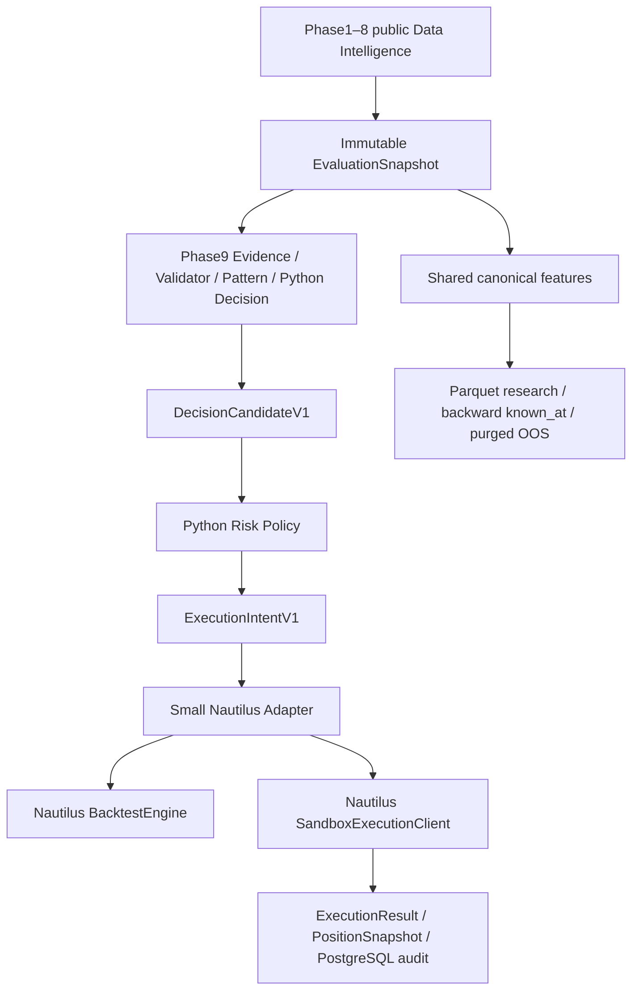

# Quant Core + NautilusTrader local integration

The implementation targets Python 3.12 on Linux x86_64, verified in Ubuntu under WSL. Nautilus is pinned to **1.231.0** in the `nautilus` optional dependency. All local scenarios are labelled `FIXTURE_DRIVEN_ACCEPTANCE`. A fixture policy tests semantic routing, risk approval and execution; it is not a validated market strategy or human production approval.

## Architecture and boundaries



Phase1–9 and `quant_execution` do not import Nautilus model types. Quant owns source quality, freshness, coverage, authority, provenance, evidence, Python decisions, approval and quantitative risk caps. Nautilus owns matching, order state, stops, positions and native account arithmetic. `quant_nautilus` translates approved quantities and emits neutral result/position contracts. The adapter never increases quantity, approves an AI proposal or substitutes missing values with zero.

Migration 017 adds execution accounts, immutable intents/results/positions, reservations, owner fencing, a bounded local input journal and funding payments. Runtime only checks readiness; installation applies migrations separately. One isolated local Paper account currently supports one intent, with at most 4096 journal entries. The native cache is rebuilt by replaying inputs into a **new local Sandbox**, then compared with every persisted checkpoint and result digest. This is local simulator recovery, with zero external order routes.

Phase10 is Risk Policy + ExecutionIntent + Adapter + local Paper; Phase11 is shared research + Nautilus Backtest; Phase12 is health, decision audit and reconciliation/recovery. Phase13 Live is deferred. No extra Kafka, Redis, ClickHouse or Kubernetes service is introduced.

## Environment and disposable database

Run from the isolated Linux worktree, using its isolated environment:

```bash
cd /home/lucas045057/projects/quant-integration-nautilus-v1
source /home/lucas045057/projects/quant-integration-nautilus-v1-env/bin/activate
export PYTHONPATH=src
export PYTHONDONTWRITEBYTECODE=1
```

A fresh environment can install the exact optional dependency with `python -m pip install -e '.[nautilus]'`. Verify `python -c "import nautilus_trader; print(nautilus_trader.__version__)"` prints `1.231.0`. The pinned wheel was verified under Linux; a native Windows installation is unverified.

Acceptance uses PostgreSQL only at loopback `127.0.0.1:55441`, database `quant_phase9_test`. Set `TEST_POSTGRES_DSN` to that disposable instance. The full regression matrix also needs `quant_phase8_test` on the same isolated instance. Do not point fixture installers at an existing application database. Installer and runtime enforce the local acceptance database name; fixtures use newly generated private schemas. The original `quant-engine`, `quant-postgres` and `agentops` are not involved.

Create a disposable instance in WSL when the loopback port is free:

```bash
docker run --detach --name quant-nautilus-local-acceptance \
  --publish 127.0.0.1:55441:5432 --memory 768m --cpus 1 --pids-limit 256 \
  --shm-size 64m --env POSTGRES_HOST_AUTH_METHOD=trust \
  --env POSTGRES_DB=quant_phase9_test postgres:16.15-bookworm
until docker exec quant-nautilus-local-acceptance pg_isready --username postgres; do sleep 1; done
docker exec quant-nautilus-local-acceptance createdb --username postgres quant_phase8_test
export TEST_POSTGRES_DSN='postgresql://postgres@127.0.0.1:55441/quant_phase9_test'
```

The isolated fixture service uses loopback-only access. Stop Paper workers before removing this exact container that you created: `docker rm --force quant-nautilus-local-acceptance`. The installer applies migrations only in its newly generated private fixture schema. The normal runtime never applies DDL.

Migration 018 adds durable Phase9 revalidation cursors and a database-serialized per-minute budget. Fresh intake runs first, followed by material notifications and scheduled revalidation. `Phase9EngineRuntime.request_revalidation(stage1_candidate_id=..., timeframe=...)` coalesces repeated notifications; callers invoke it after canonical input changes. Scheduled passes also detect semantic changes. Recovered work retains its exact generation and snapshot. Numeric drift with unchanged semantic evidence writes an auditable evaluation outcome without another decision; semantic change inserts the replacement and supersede event atomically. TTL expiry is append-only and risk checks the clock independently. Required freshness rules are rechecked at final persistence. A database deadline cancels slow local statements; a hard contract failure is recorded without automatic retry.

Conflict review runs through the existing Phase6 gateway and nested validator. The local acceptance selector supports Fake and a bound synthetic Recorded response; both retain unresolved conflict and never approve trading. The normal runtime records an explicit NOT_CONFIGURED review when needed. Real Jev remains deferred. Position equity includes native unrealized PnL; occupied margin and free balance come from the native account. Recovery rejects every stored funding payment absent from the rebuilt native replay.

## Backtest and funding/cost model

```bash
python -m quant_nautilus.acceptance \
  --fixture-dir artifacts/phase9/backtest-fixtures \
  --output artifacts/phase9/backtest.json
```

Four deterministic BTC/ETH LONG/SHORT cases go through Stage1 → immutable snapshot → real Phase9 evidence/validator/pattern/decision → Python risk → intent → native market IOC and reduce-only stop → fill/result → position/account attribution. The fixture routes both TREND_CONTINUATION and BREAKOUT_CONFIRMATION. Its semantic presence predicates do not establish a genuine breakout edge.

Native `MakerTakerFeeModel`, instrument fixture maker/taker schedules, quote spread, `FillModel` and explicit 20ms latency drive fills. All market IOC and stop fills are taker trades; maker fees are configured but not charged to these market trades. Gross PnL uses decision and exit quote mids; trading PnL uses actual native fills; spread and latency slippage are attributed separately. Net equals actual fill trading PnL minus actual fees plus signed funding, so spread/slippage are not deducted twice. Negative slippage is price improvement. Final native account cash must reconcile exactly within USDT currency precision. The intentionally losing stop scenarios are reported as losses.

Funding is **ADAPTER_IMPLEMENTED**. One pure exact calculator is shared across backtest and Paper. Cash is `-signed_base_quantity_at_boundary × settlement_mark × settled_rate`, rounded to 8 USDT decimals. Native fill histories strictly before the boundary determine held quantity, including positions later closed. Unsettled/future/missing rate or mark leaves funding unresolved; it cannot produce a resolved net return. A payment key binds account, instrument and boundary; repeated settlement is immutable and idempotent. Native `adjust_account` changes real simulated account balances; funding does not contaminate trade PnL.

## Start, stop, health and audit for local Paper

Prepare a new local fixture in an empty directory. Its approved intent has a 60-second submission TTL; start the worker immediately after installation:

```bash
python -m quant_nautilus.fixture_setup \
  --symbol BTCUSDT --side LONG \
  --output-dir artifacts/phase9/manual-paper
export QUANT_PAPER_DSN="$TEST_POSTGRES_DSN"
```

Read `schema` and `intent_id` from `artifacts/phase9/manual-paper/fixture.json`, then run in the foreground, substituting those two literal values:

```bash
python -m quant_nautilus.paper \
  --schema SCHEMA_FROM_FIXTURE \
  --intent-id INTENT_ID_FROM_FIXTURE \
  --ready-file artifacts/phase9/manual-paper/health.json \
  --fixture-run
```

The worker uses a real `SandboxExecutionClient` and quote ticks. It keeps the filled native position and protective stop open, settles fixture funding and renews its account lease. Read `health.json` for `state=RECONCILED`, native order states, result digests, full position snapshot, funding cash, PID, RSS, peak RSS and journal count. `state_digest` binds order/position/result/funding state. The heartbeat `as_of` must continue advancing; a stale file is not a healthy running process.

Stop with **Ctrl+C** in the foreground terminal, or send SIGTERM to the PID shown by the active worker's health record. Graceful stop releases the ownership lease. A crashed process retains its short lease until expiration; a competing owner cannot submit while it is held. Startup does not change any runtime schema or read exchange credentials.

Decision audit is stored in `phase9_decision_candidates`, `phase9_evidence_chains`, `phase9_evidence_items`, `phase9_pattern_matches`, `phase9_evaluation_snapshots` and status events in the fixture schema. The execution join is `execution_intents.decision_id/evaluation_id`, and results use `intent_id`; positions use account and canonical symbol. Inspect these through a local PostgreSQL connection using the same fixture schema. Keep full account/order payloads in the local audit store, not general logs.

## Recovery and reconciliation

After stopping the process, use the same schema and intent with:

```bash
python -m quant_nautilus.paper \
  --schema SCHEMA_FROM_FIXTURE \
  --intent-id INTENT_ID_FROM_FIXTURE \
  --ready-file artifacts/phase9/manual-paper/restored-health.json \
  --fixture-restore
```

It recreates native simulator state from the write-ahead journal, checks checkpoint digests, existing native result mappings and funding payments, then writes `restored=true` and the same `state_digest`. It does not send a second entry into the restored account. Crash after native submission but before result persistence is tested in a genuinely new process; missing results are repaired from the restored native state. UNKNOWN without a durable local command remains fail-closed. A digest mismatch blocks recovery instead of silently producing a neutral/empty account.

The complete measured two-case acceptance installs isolated schemas, starts each worker for at least 60 continuous seconds, stops it, starts a new process, compares state/audit, and removes its own schemas:

```bash
python -m quant_nautilus.paper_acceptance \
  --duration-seconds 60 --output-dir artifacts/phase9/paper-final
```

`--smoke --duration-seconds 1` is useful for development and always reports `formal_acceptance_pass=false`. Process resource values are measured, not estimated. The original budgets remain PostgreSQL 768 MiB, Collector 256 MiB, Engine 384 MiB. Do not treat this small fixture sample as a long-running production sizing claim.

## Research and preserved historical semantics

`quant_features` freezes one set of definitions, exact Decimal units and backward `known_at` alignment. `snapshot_features` projects frozen Quant facts through these same definitions. Every observation preserves source timestamps, received/processed/known time, status, quality, freshness, coverage, authority, provenance, revision and PIT coverage. Missing, UNKNOWN and partial liquidation coverage remain unavailable for a directional numerical comparison.

Export actual PostgreSQL snapshots using their existing immutable UUIDs, without a provider call or DDL:

```bash
export QUANT_RESEARCH_DSN="$TEST_POSTGRES_DSN"
python -m quant_research.commands export \
  --schema SCHEMA_FROM_FIXTURE --evaluation-id EVALUATION_UUID \
  --output-dir artifacts/phase9/research-data
```

The content-addressed Parquet manifest verifies byte/record/definition digests; a lineage file binds the exported PostgreSQL evaluation IDs and snapshot digests. The exporter uses a read-only repeatable-read transaction. It never upgrades `PIT_UNVERIFIED` or `UNVERIFIED` facts into historical point-in-time data. The current Phase9 integration fixture has only a few observations and cannot supply a genuine multi-period research cohort.

Research labels are a bounded JSON object with schema `QUANT_RESEARCH_LABELS_V1` and `rows`. Each row has exactly `symbol`, `as_of`, `previous_as_of`, `label_end`, `future_return`, `settled_funding_rate`, `regime`, `source_ref`. UTC times are strings; exact returns/rates are Decimal strings, with nullable funding. Each label has `previous_as_of < as_of < label_end`; no label is used to construct a feature or decide a direction. Label provenance remains in the output report.

```bash
python -m quant_research.commands evaluate \
  --manifest PARQUET_MANIFEST.json --labels LABELS.json \
  --min-train 8 --test-size 4 --embargo-seconds 300 \
  --output artifacts/phase9/research-report.json
```

Default research requires verified POINT_IN_TIME features. `--allow-fixture` explicitly permits synthetic/unverified experiments and still reports `strategy_edge_status=NOT_VALIDATED`. The five requested hypotheses and a price-only control use one common eligible cohort. Breakout compares price with the known prior closed-price range, using the shared price freshness limit. Chronological test folds purge training labels crossing the test boundary and enforce embargo. Thresholds and fee/spread/slippage assumptions are predeclared; no optimization or production policy activation occurs. Research funding uses one declared boundary per label with mark/entry ratio 1, an explicit approximation, while the native backtest/Paper gate uses actual account cash accounting.

## Verification and final evidence

```bash
python -m quant_phase9.compatibility_gate --require-pass
python -m pytest -q tests/quant_execution tests/quant_nautilus tests/quant_research
python scripts/run_phase9_test_matrix.py --scope full \
  --junitxml artifacts/phase9/full-regression.xml
python scripts/run_phase9_acceptance.py --mode formal
```

Formal Phase9 acceptance preserves the exact A1–A7 commands and the **900-second** runtime minimum. After its report-only commit, `--mode finalize` verifies A8/A9, source/report ancestry and the nineteen-task C1 proof. Full regression excludes only the eight explicitly opt-in external network tests; required local tests must have zero skips. Real Jev remains NOT_CONFIGURED, with deterministic Fake/Recorded replay acceptance and Python as the final gate.

Final approval depends on fresh full regression, compatibility, 900-second acceptance, native backtest, Paper restart, funding/cost and measured resource evidence. Pending results must remain pending. The original checkout and existing containers are preserved; disposable acceptance infrastructure is removed after verification. No push, merge, PR, tag, release or Live execution is part of this implementation.
